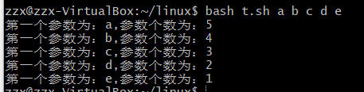

# 第四章：shell脚本编程基础


* 任务一：用bash编写一个图片批处理脚本，实现以下功能：
     *  支持命令行参数方式使用不同功能
     *  支持对指定目录下所有支持格式的图片文件进行批处理
      *  支持以下常见图片批处理功能的单独使用或组合使用
         
          * 支持对`jpeg`格式图片进行图片质量压缩
          
           * 支持对`jpeg/png/svg`格式图片在保持原始宽高比的前提下压缩分辨率
             
          * 支持对图片批量添加自定义文本水印
          
          * 支持批量重命名（统一添加文件名前缀或后缀，不影响原始文件扩展名）
          
          * 支持将`png/svg`图片统一转换为`jpg`格式图片
          
            ```bash
          #!/bin/bash
            quality="70"            #图片质量
            RESOLUTION="50%x50%"    #图片压缩率
            
            #flag
            Q_FLAG=0   			#质量压缩
            R_FLAG=0
            W_FLAG=0				#加水印
            C_FLAG=0				#格式转换
            H_FLAG=0				#帮助信息flag
            
            watermark=""            #图片水印
            PREFIX=""				#前缀
            POSTFIX=""
            
            DIR=`pwd`              #要操作的图片目录
            #输出帮助信息
            useage()   
            {
              echo "Useage:bash test.sh  -d <directory> [option|option]"
              echo "options:"
              echo "  -d [directory]                想处理文本的文件路径"
              echo "  -c                            png/svg -> jpg"
              echo "  -r|--resize [width*height|width]    保持某个压缩比进行图像压缩 700x700 or 50%x50%   如果输入的是一个数值 就是保持原始纵横比进行压缩"
              echo "  -q|--quality [number]          对jpg图像进行质量压缩"
              echo "  -w|watermark [watermark]       添加水印"
              echo "  --prefix[prefix]               添加前缀"
              echo "  --postfix[postfix]             添加后缀"
            }
            main(){
              echo "main 函数"
              echo "H_FLAG:$H_FLAG"
            if [ $H_FLAG == 1 ] ; then 
              echo "Help"
              useage
            fi
            
            if [ ! -d "$DIR" ] ;then
              echo "没有这个路径"
              exit 0
            fi
            
            #再目录下建一个目录来保存处理好的图片输出
            outimg=${DIR}/outimg
            mkdir -p $outimg
            
            command="convert"
            IM_FLAG="2"
            if [ $Q_FLAG == 1 ] ; then 
              IM_FLAG="1"
              command=${command}" -quality "${quality}
            fi
            if [ $R_FLAG == 1 ] ; then 
              echo "保持原始宽高比的前提下压缩分辨率";
              command=${command}" -resize "${RESOLUTION}
            fi
            if [ $W_FLAG == 1 ] ; then 
              echo "加水印:${watermark}" 
              command=${command}" -fill white -pointsize 40 -draw 'text 10,50 \"${watermark}\"' "
            fi
            
            if [ $C_FLAG == 1 ] ; then 
              IM_FLAG="2"
              echo "转换格式"
            fi
            
            
            case "$IM_FLAG" in
                   1) images=`find $DIR -maxdepth 1 -regex '.*\(jpg\|jpeg\)'` ;;
                   2) images=`find $DIR -maxdepth 1 -regex '.*\(jpg\|jpeg\|png\|svg\)'` ;;
            esac
            #根据指令处理每一个图片
            for CURRENT_IMAGE in $images; do
                 filename=$(basename "$CURRENT_IMAGE")  #只取出文件名  .2.jpeg
                 name=${filename%.*}                    #去掉后缀    .2
                 suffix=${filename#*.}                  #取出后缀     .jpeg
                 if [[ "$suffix" == "png" && $C_FLAG == 1 ]]; then 
                   suffix="jpg"
                 fi
                 if [[ "$suffix" == "svg" && $C_FLAG == 1 ]]; then
                   suffix="jpg"
                 fi
                 savefile=${outimg}/${PREFIX}${name}${POSTFIX}.${suffix}  #重新拼出一个存储路径
                 temp=${command}" "${CURRENT_IMAGE}" "${savefile}  #指令 需要执行操作的图片路径  图片操作后存储路径
                 
                 #运行拼凑出来的指令
                 eval $temp     
                 echo $temp
            done
            exit 0
            }
            #-o表示短选项，两个冒号表示该选项有一个可选参数，可选参数必须紧贴选项
            #如-carg 而不能是-c arg
            #--long表示长选项
            #"$@"在上面解释过
            # -n:出错时的信息
            # -- ：举一个例子比较好理解：
            #我们要创建一个名字为 "-f"的目录你会怎么办？
            # mkdir -f #不成功，因为-f会被mkdir当作选项来解析，这时就可以使用
            # mkdir -- -f 这样-f就不会被作为选项。
            #getops和getopt的冒号作用是不一样的： 一. 对于getops 1. 第一个字符是冒号，表面忽略错误信息 2. 字母后面的单冒号，表示带参数，不带也行（只有最后一个选项才可以不带参数） 3. 字母后面的双冒号，表示强制带参数，不带参数报错
            
            TEMP=`getopt -o cr:d:q:w: --long quality:arga,directory:,watermark:,prefix:,postfix:,help,resize: -n 'test.sh' -- "$@"`
            eval set --"$TEMP";
            echo "命令：$TEMP"
            
            while true ; do   
                case "$1" in
                    -c) C_FLAG=1 ; 
                    echo "C_FLAG是${C_FLAG}";
                    shift ;;
                    -d|--directory)
                    	echo "路径：$2"
                    	case "$2" in
                    		"") shift 2 ;;
                         *) DIR=$2 ; echo "新的路径：${DIR}";shift 2 ;;	 
                      esac;;    
                    -q|--quality) Q_FLAG="1";
                        case "$2" in
                            "") shift 2 ;;
                             *) quality=$2; shift 2 ;;  #todo if the arg is integer
                        esac ;;
            
                    --help) H_FLAG=1;
                    	echo "帮助标记:$H_FLAG";shift;;
            
                    -r|--resize) R_FLAG=1; echo "R_FLAG=$R_FLAG";
                      case "$2" in
                            "") shift 2 ;;
                            *)RESOLUTION=$2 ; shift 2 ;;
                        esac ;;
            
                    -w) W_FLAG=1;
                     	case "$2" in
                     		"") shift;;
                     		*) watermark=$2;echo "水印：${2}";shift 2;;
                      esac;;
            
                    --prefix) PREFIX=$2;shift 2;;
            
                    --postfix) POSTFIX=$2;shift 2;;
            
                    --) shift ; break;;
            
                    *) echo "Internal error!" ; exit 1;;
                esac
            done
            main
            #todo
            ```
            

几个小的点：

1. 查看图片大小`indentify`：


2. shift命令用于对参数的移动（左移），通常用于再不知道传入参数的情况下遍历灭一个参数然后进行相应的处理

例如：

```bash
#!/usr/bin/env bash

while [ $# != 0 ];do
echo "第一个参数为：$1,参数个数为：$#"
shift
done
```

 输入如下命令运行：run.sh a b c d e f 

结果：




3. getopt命令可以接受一系列任意形式的命令行选项和参数，并自动将它们转换成适当的格式。格式如下： 

` getopt optstring parameters `

* 任务二：用bash编写一个文本批处理脚本，对以下附件分别进行批量处理完成相应的数据统计任务： 
  * 2014世界杯运动员数据
    * 统计不同年龄区间范围（20岁以下、[20-30]、30岁以上）的球员**数量**、**百分比**
    * 统计不同场上位置的球员**数量**、**百分比**
    * 名字最长的球员是谁？名字最短的球员是谁？
    * 年龄最大的球员是谁？年龄最小的球员是谁？

```shell
#以\t'为分隔符 找到第六行
age=$(awk -F '\t' '{print $6}' worldcupplayerinfo.tsv)
awk -F '\t' '{print $6}' worldcupplayerinfo.tsv
	sum=0
	age_count1=0
	age_count2=0
	age_count3=0

	for num in $age
	do
	    if [ "$num" != 'Age' ] ; then #去掉第一行
      		let sum+=1

			if [ "$num" -lt 20 ] ; then 
		    	# let age_count1+=1  
		    	age_count1=$((${age_count1}+1))
			fi

      		if [ "$num" -ge 20 ] && [ "$num" -le 30 ] ; then 
		    	let age_count2+=1
                #echo "age_count2=${age_count2} num=${num}"
			fi

      		if [ "$num" -gt 30 ] ; then 
		    	let age_count3+=1  
			fi

         fi
	done
	
echo "年龄统计情况： "
echo "<20岁球员数量:${age_count1} ，所占百分比为$(echo "scale=2; ${age_count1}*100/${sum}" | bc)%"
echo "[20-30]的球员数量:${age_count2} ，所占百分比为$(echo "scale=2; ${age_count2}*100/${sum}" | bc)%"
echo ">30岁的球员数量:${age_count3} ，所占百分比为$(echo "scale=2; ${age_count3}*100/${sum}" | bc)%"

#位置统计
position=$(awk -F '\t' '{print $5}' worldcupplayerinfo.tsv)

position_count_Goalie=0;
position_count_Defender=0
position_count_Midfielder=0
position_count_Forward=0

	for pos in $position
	do
	#echo "pos是:$pos"
	   		if [ "$pos" == 'Forward' ] ; then
      		let position_count_Forward+=1
 			fi
			if [ "$pos" == 'Midfielder' ] ; then 
		    	# let age_count1+=1  
		    	position_count_Midfielder=$((${position_count_Midfielder}+1))
			fi

      		if [ "$pos" == 'Defender' ]; then 
		    	let position_count_Defender+=1
                #echo "position_count_Defender=${position_count_Defender}"
			fi

      		if [ "$pos" = 'Goalie' ] ; then 
		    	let position_count_Goalie+=1  
			fi

         
	done
echo "位置统计情况： "
echo "Forward位球员数量:${position_count_Forward} ，所占百分比为$(echo "scale=2; ${position_count_Forward}*100/${sum}" | bc)%"
echo "Midfielder位球员数量:${position_count_Midfielder} ，所占百分比为$(echo "scale=2; ${position_count_Midfielder}*100/${sum}" | bc)%"
echo "Defender位球员数量:${position_count_Defender} ，所占百分比为$(echo "scale=2; ${position_count_Defender}*100/${sum}" | bc)%
echo "Defender位球员数量:${position_count_Goalie} ，所占百分比为$(echo "scale=2; ${position_count_Goalie}*100/${sum}" | bc)%

#名字长短
namelen=$(awk -F '\t' '{print $9}' worldcupplayerinfo.tsv)
min=999
max=0
mintemp=''
maxtemp=''
for len in $namelen
do
	echo "len:${len},长度：${#len}"
	if [ ${#len} -lt $min ] ; then
		echo "min:${min}"
	 	min=${#len}
	 	mintemp=${len}
	 	echo "mim:${min} 短名字:${len}"
	fi
	if [ ${#len} -gt $max ] ; then
		echo "max:${max}"
	 	max=${#len}
	 	maxtemp=${len}
	 	echo "max:${max} 长名字:${maxtemp}"
	fi
	
done
  
echo "找出最长最短的名字："
echo "最长名字：${maxtemp},长度:${max}"
echo "最短名字：${mintemp},长度：${min}"
#年纪大小
agenum=$(awk -F '\t' '{print $6}' worldcupplayerinfo.tsv)
young=999
old=0
# echo "agenum:${agenum}"
for ages in $agenum
do

	if [ $ages -lt $young ] ; then
		 young=$ages
	fi
	if [ $ages -gt $old ] ; then
    	old=$ages
	fi
done

echo "找出最大最小的年龄："
echo "最大：${old}"
echo "最小：${young}"
```

**几个点**：

* **bc命令**是一种支持任意精度的交互执行的计算器语言。bash内置了对整数四则运算的支持，但是并不支持浮点运算，而bc命令可以很方便的进行浮点运算，当然整数运算也不再话下。

* [awk分隔符]( https://www.zsythink.net/archives/1357 ) 

* **shell脚本中大于，大于等于，小于，小于等于、不等于的表示方法**

  症状：shell中大于，大于等于，小于等于，lt,gt ,ne,ge,le 很对应。

  应对方法：

  大于 -gt (greater than)
  小于 -lt (less than)
  大于或等于 -ge (greater than or equal)
  小于或等于 -le (less than or equal)
  不相等 -ne （not equal）

* 注意空格  `      		if [ "$pos" == 'Defender' ]; then `每个字符都要有空格

* 在赋值的时候与等号不能有空格

  


```bash
#!/bin/bash

count=0  # 总球员数

age_count_1=0  # 20岁以下
age_count_2=0  # [20-30]
age_count_3=0  # 30岁以上

pos_count_forward=0
pos_count_midfielder=0
pos_count_defender=0
pos_count_goalie=0

name_longest=""
name_shortest=""
name_longest_count=0
name_shortest_count=100

age_max_name=""
age_min_name=""
age_max=0
age_min=100

input="worldcupplayerinfo.tsv"

first=0

while IFS= read -r line || [[ -n "$line" ]]
do
    line=${line// /-}
    array=(${line})
    count=$((${count}+1))
    # 跳过第一行
    if [[ first -eq 0 ]]; then first=1; continue; fi 
    # 统计年龄
    if [[ ${array[5]} -lt 20 ]]; then
        age_count_1=$((${age_count_1}+1))
    elif [[ ${array[5]} -gt 30 ]]; then
        age_count_3=$((${age_count_3}+1))
    else
        age_count_2=$((${age_count_2}+1))
    fi
    # 统计位置
    if [[ "${array[4]}" = 'Forward' ]]; then
        pos_count_forward=$((${pos_count_forward}+1))
    elif [[ "${array[4]}" = 'Midfielder' ]]; then
        pos_count_midfielder=$((${pos_count_midfielder}+1))
    elif [[ "${array[4]}" = 'Defender' ]]; then
        pos_count_defender=$((${pos_count_defender}+1))
    else
        pos_count_goalie=$((${pos_count_goalie}+1))
    fi
    # 统计最长最短名字
    len=${#array[8]}
    if [[ $len -lt $name_shortest_count ]]; then
        name_shortest_count=$len
        name_shortest=${array[8]}
    elif [[ $len -gt $name_longest_count ]]; then
        name_longest_count=$len
        name_longest=${array[8]}
    fi
    # 统计年龄最大最小名字
    if [[ ${array[5]} -lt $age_min ]]; then
        age_min=${array[5]}
        age_min_name=${array[8]}
    elif [[ ${array[5]} -gt $age_max ]]; then
        age_max=${array[5]}
        age_max_name=${array[8]}
    fi


done < "$input"

echo "输入文件 [$input]"
echo "------- 年龄统计 ------- "
echo "20岁以下球员数量为${age_count_1} ，所占百分比为$(echo "scale=2; ${age_count_1}*100/${count}" | bc)%"
echo "[20-30]的球员数量为${age_count_2} ，所占百分比为$(echo "scale=2; ${age_count_2}*100/${count}" | bc)%"
echo "30岁以上的球员数量为${age_count_3} ，所占百分比为$(echo "scale=2; ${age_count_3}*100/${count}" | bc)%"
echo "------- 位置统计 ------- "
echo "位置是Forward的球员数量为${pos_count_forward} ，所占百分比为$(echo "scale=2; ${pos_count_forward}*100/${count}" | bc)%"
echo "位置是Midfielder的球员数量为${pos_count_midfielder} ，所占百分比为$(echo "scale=2; ${pos_count_midfielder}*100/${count}" | bc)%"
echo "位置是Defender的球员数量为${pos_count_defender} ，所占百分比为$(echo "scale=2; ${pos_count_defender}*100/${count}" | bc)%"
echo "位置是Goalie的球员数量为${pos_count_goalie} ，所占百分比为$(echo "scale=2; ${pos_count_goalie}*100/${count}" | bc)%"
echo "------- 最长名字和最短名字 -------"
echo "最长名字的球员是${name_longest}"
echo "最短名字的球员是${name_shortest}"
echo "------- 最大年龄和最小年龄 -------"
echo "最大年龄是${age_max}，球员是${age_max_name}"
echo "最小年龄是${age_min}，球员是${age_min_name}"
```


```shell
#!/bin/bash

function age_stats
{
	age=$(awk -F '\t' '{print $6}' worldcupplayerinfo.tsv)
	sum=0
	a=0
	b=0
	c=0

	for n in $age
	do
	    if [ "$n" != 'Age' ] ; then
      		let sum+=1

		if [ "$n" -lt 20 ] ; then 
		    let a+=1  
		fi

      		if [ "$n" -ge 20 ] && [ "$n" -le 30 ] ; then 
		    let b+=1  
		fi

      		if [ "$n" -gt 30 ] ; then 
		    let c+=1  
		fi

            fi
	done

	ratio1=$(awk 'BEGIN{printf "%.3f",'"$a"*100/"$sum"'}')
	ratio2=$(awk 'BEGIN{printf "%.3f",'"$b"*100/"$sum"'}')
	ratio3=$(awk 'BEGIN{printf "%.3f",'"$c"*100/"$sum"'}')

	echo "---------------- # Age Statistics # --------------------"
	echo "--------------------------------------------------------"
	echo "|    Age     |    < 20    |    20 ~ 30    |    > 30    |"
	echo "--------------------------------------------------------"
	echo "|Total Number|     "$a"      |      "$b"      |    "$c"     |"
	echo "--------------------------------------------------------"
	echo "| Proportion |   "$ratio1" "%"  |    "$ratio2" "%"   |  "$ratio3" "%"  |"
	echo "--------------------------------------------------------" 


	temp=$(sort -k6 worldcupplayerinfo.tsv| awk -F'\t' '{print $6 "\t" $9}'|head > target.txt)
 	min_names=$(more target.txt | awk -F'\t' 'BEGIN{min=100;i=1}{if(min>=$1){min=$1;name[i++]=$2}}END{for(n in name)print name[n]}')
	min=$(more target.txt | awk -F'\t' 'BEGIN{min=100;i=1}{if(min>=$1){min=$1}}END{print min}')
	echo "---- # the youngest players ("$min") # ----"
	echo "$min_names"

	temp=$(sort -k6 -nr worldcupplayerinfo.tsv| awk -F'\t' '{print $6 "\t" $9}'|head > target1.txt)
	max_names=$(more target1.txt | awk -F'\t' 'BEGIN{max=0;i=1}{if(max<=$1){max=$1;name[i++]=$2}}END{for(n in name)print name[n]}')
	max=$(more target1.txt | awk -F'\t' 'BEGIN{max=0;i=1}{if(max<=$1){max=$1}}END{print max}')
	echo "---- # the oldest players ("$max") # ----"
	echo "$max_names"
}


function position_stats
{	
	num=$(sed -n '2, $ p' worldcupplayerinfo.tsv|awk -F '\t' '{print $5}'|sort -r|uniq -c|awk '{print $1}')
	position=$(sed -n '2, $ p' worldcupplayerinfo.tsv|awk -F '\t' '{print $5}'|sort -r|uniq -c|awk '{print $2}')
	n=($num)
	p=($position)
        
	sum=0
	
	for i in $num
	do
	    let sum+=$i
	done

	i=0

	for n in ${num[@]}
	do
	    b["$i"]=$(echo "scale=3; 100*$n / $sum "|bc)

 	    i=$((i+1))
	done
	

	echo "---------- # Position Statistics # --------------"
	echo "-------------------------------------------------"	


	i=0
	p=($position)
	n=($num)
	
	for k in $(seq 0 $(echo "${#n[@]}-1"|bc))
	do
	    echo "Position: ${p[$i]}"
	    echo "Number: ${n[$i]} "
	    echo "Proportion: ${b[$i]} %"
	    let i+=1
	done
}

function name_stats
{
	longest=$(awk -F'\t' 'BEGIN{max=0}{if(length($9)>max){max=length($9);}}END{print max}' worldcupplayerinfo.tsv)
	long_names=$(awk -F'\t' 'BEGIN{longest='$longest';i=1}{if(length($9)==longest){name[i++]=$9}}END{for(n in name)print name[n]}' worldcupplayerinfo.tsv)
	shortest=$(awk -F'\t' 'BEGIN{min=100}{if(length($9)<min){min=length($9);}}END{print min}' worldcupplayerinfo.tsv)
        short_names=$(awk -F'\t' 'BEGIN{shortest='$shortest';i=1}{if(length($9)==shortest){name[i++]=$9}}END{for(n in name)print name[n]}' worldcupplayerinfo.tsv)
	
	echo "---- # the players whose name is longest ($longest) ----"
        echo "${long_names}"

	echo "--- # the players whose name is shortest ($shortest) ---"
        echo "${short_names}"


}

function main
{
age_stats
echo -e
echo -e
position_stats
echo -e
echo -e
name_stats
}

main


```


任务二：用bash编写一个文本批处理脚本，对以下附件分别进行批量处理完成相应的数据统计任务： 

- Web服务器访问日志
  - 统计访问来源主机TOP 100和分别对应出现的总次数
  - 统计访问来源主机TOP 100 IP和分别对应出现的总次数
  - 统计最频繁被访问的URL TOP 100
  - 统计不同响应状态码的出现次数和对应百分比
  - 分别统计不同4XX状态码对应的TOP 10 URL和对应出现的总次数
  - 给定URL输出TOP 100访问来源主机

```shell
#!/bin/bash
url="/"

#统计不同的host
host_top()
{
echo -e "统计访问来源主机TOP 100和分别对应出现的总次数 \n"
more +2 web_log.tsv | awk -F\\t '{print $1}' |  sort | uniq -c | sort -nr | head -n 100|awk '{print $2,$1}'


exit 0
}

#统计不同的ip 使用正则匹配ip   是指统计ip的意思吗
ip_top()
{
echo -e  "统计访问来源主机TOP 100 IP和分别对应出现的总次数 \n"
more +2 web_log.tsv | awk -F\\t '{print $1}' | egrep '[[:digit:]]{1,3}\.[[:digit:]]{1,3}\.[[:digit:]]{1,3}\.[[:digit:]]{1,3}' | sort | uniq -c | sort -nr | head -n 100|awk '{print $2,$1}'
exit 0
}

#直接排序
frequency_url_top()
{
#统计最频繁被访问的URL TOP 100
echo -e "统计最频繁被访问的URL TOP 100 \n"
more +2 web_log.tsv |awk -F\\t '{print $5}'|sort|uniq -c |sort -n -k 1 -r|head -n 100|awk '{print $2}'
exit 0
} 


responsecode_stat()
{
#统计不同响应状态码的出现次数和对应百分比
a=$(more +2 web_log.tsv |awk -F\\t '{print $6}'|sort|uniq -c |sort -n -k 1 -r|head -n 10|awk '{print $1}')
b=$(more +2 web_log.tsv |awk -F\\t '{print $6}'|sort|uniq -c |sort -n -k 1 -r|head -n 10|awk '{print $2}')
sum=0
count=($a)
responsecode=($b)

for i in $a ;do
	sum=$(($sum+$i)) 
done

i=0
for n in ${count[@]};do
b[$i]=$(echo "scale=2; 100*${n} / $sum"|bc)
  i=$((i+1))
done

echo -e "------响应码数据----------  \n"
i=0
for n in ${count[@]};do
echo -e "${responsecode[$i]} $n ${b[$i]}% \n " 
i=$((i+1))
done

exit 0
}


#4xxURL状态码对应的TOP 10 URL和对应出现的总次数
responsecode_top()
{

echo -e "4xxURL状态码对应的TOP 10 URL和对应出现的总次数 \n"
right=500
left=399

#首先过滤出所有4xx状态
a=$(more +2 web_log.tsv |awk -F\\t '{print $6}'|sort|uniq -c |awk '{print $2}')

#这个时候拿到了所有的响应码的数组
count=($a)

#进行循环遍历 如果是4xx 就进行抓取 否则不作处理
i=0
for n in ${count[@]};do
	if [ $n -lt $right ]&&[ $n -gt $left ]  #如果这个取值是4xx
 then
   echo ${n}      #响应码  url
   #怎么拼接字符串
   more +2 web_log.tsv |awk -F\\t '{print $6,$5}' | grep ${n}" " |sort|uniq -c |sort -n -k 1 -r|head -n 10|awk '{print $3,$1}'
 fi
done


exit 0
}


url_host()
{
url="	"$url"	"
echo -e "给定URL输出TOP 100访问来源主机 \n"
temp="more +2 web_log.tsv |grep \""'${url}'"\"|awk -F'\t' '{print "'$1'"}'|sort|uniq -c|sort -nr|head -n 10"
#echo $temp

eval -- $temp
exit 0
}


useage()
{
	echo "Usage: bash test3.sh [OPTION]"

	echo "-a				show TOP 100 host and count"
	echo "-b 				show TOP 100 IP and count"
	echo "-c 				show TOP 100 frequency url and count"
	echo "-d 				show responsecode and count and porprotion"
	echo "-e 				show TOP 10 4XX responsecode  url and count"
	echo "-f [url]			show TOP 100 given url of host and count"	
	exit 0
}


option=`getopt -o a,b,c,d,e,f: --long help -n 'test.sh' -- "$@"`

eval set -- "$option"

while true; do
	case "$1" in 
		-a) host_top ;shift ; break;;
        -b) ip_top ; shift ; break;;
		-c) frequency_url_top ; shift ; break;;
		-d) responsecode_stat ; shift ; break;;
		-e) responsecode_top ; shift ; break;;
		-f) url=$2 ; url_host; shift ; break ;;
     	--help) useage ; shift ; break ;;
        --)shift; break ;;
 		*) echo "Internal error! see --help for more information"; exit 1 ;;
	esac
done

```

```shell
# Top 100

echo "------ # Top 100 hosts and according frequencies # -------"
echo -e
top100Host=$(more web_log.tsv | awk -F '\t' '{print $1}'| sort | uniq -c | sort -k1 -nr | head -n 100)
echo "$top100Host"


echo "---- # Top 100 hosts' IP and according frequencies # -----"
echo -e
top100IP=$(more web_log.tsv | awk -F '\t' '{print $1}' | egrep '[[:digit:]]{1,3}\.[[:digit:]]{1,3}\.[[:digit:]]{1,3}\.[[:digit:]]{1,3}' | sort | uniq -c | sort -k1 -nr | head -n 100)
echo "$top100IP"


echo "--- # Top 100 busiest URLs and according frequencies # ---"
echo -e
top100URL=$(more web_log.tsv |awk -F '\t' '{print $5}' | sort | uniq -c | sort -k1 -nr | head -n 100)
echo "$top100URL"

function RespStats
{

	respCode=$(sed -n '2,$ p' web_log.tsv |awk -F'\t' '{print $6}'| sort | uniq -c | sort -nr | head -n 10 | awk '{print $2}')

	respCount=$(sed -n '2,$ p' web_log.tsv |awk -F'\t' '{print $6}'| sort | uniq -c |sort -nr | head -n 10 | awk '{print $1}')

	code=($respCode)
	count=($respCount)

	sum=0
	 for i in $respCount
	 do
		sum=$((${sum}+${i}))
	done

	p=0
	for k in ${count[@]}
	do	
		ratio[${p}]=$(echo "scale=4; 100*${k}/$sum"|bc)
		let p+=1
	done
	
	echo -e
	echo -e "----- # Response Code Statistics # -----"
	echo "----------------------------------------"
	echo -e
	for i in $(seq 0 $(echo "${#count[@]}-1"|bc))
	do
		echo "Response Code: "${code[${i}]}" "
		echo "Response Count: "${count[${i}]}" "
		echo "Proportion: "${ratio[${i}]}" %"
	done
	echo -e


	# Top10 Url Over 4xx
	# Top1/our/lover/4xx

	temp=$(more web_log.tsv | awk -F'\t' '{if(substr($6,1,1)==4)print $5"\t"$6}' > target2.txt)
	codes_type=$(more target2.txt | awk -F'\t' '{print $2}'| sort | uniq -c | awk '{print $2}')
	codes_count=$(more target2.txt | awk -F'\t' '{print $2}'| sort | uniq -c | awk '{print $1}')

	# 404 403
	for t in $codes_type
	do	
		
		echo -e "-------# Top 10 urls for response code $t # -------"
		echo -e
		echo "| Frequency |"
		echo -e
		url=$(more target2.txt | awk -F'\t' '{if($2=='$t')print $1}' | sort | uniq -c | sort -nr | head)	
		echo "$url"
		echo -e
	done
	
	

	# Specify a url then find out top 100 hosts ( non-interactive )
	
	url="/images/NASA-logosmall.gif"
	
	echo -e
	echo "----- # Top 100 hosts which visited "$url" # ------"
	echo -e
	echo "| frequency |"
	echo -e 
	hosts=$(more web_log.tsv | awk -F'\t' '{if("'$url'"==$5)print $1}' | sort | uniq -c | sort -k1 -nr |head -n 100)
	echo "$hosts"

	
}

RespStats

```


## 参考

[awk](http://www.zsythink.net/archives/1336)

[getopt和getopts的使用]( https://blog.csdn.net/wh211212/article/details/53750366 )

[linux-2019-jackcily]( https://github.com/CUCCS/linux-2019-jackcily )

