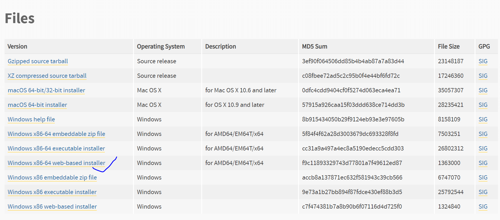
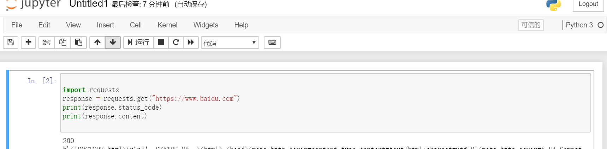

# python学习笔记1


## 下载python

去官网[下载]( https://www.python.org/downloads/windows/ )

根据电脑的操作类型下载安装包

- 安装包选择**tips**

  **Windows x86-64 embeddable zip file** 是嵌入式压缩包，缺少了一些Python的组件。不建议使用。
   **Windows x86-64 executable installer** 是可执行的安装包，带有所有组件，我们只需要在安装过程中对一些必要的设置勾选就好。**推荐使用**。
   **Windows x86-64 web-based installer** 是基于网络的安装包，它会在你启动之后，选择了版本，从网上下载具体的Python文件。但是有一个缺点，它会强制把你的安装目录安装到非常深层次的C盘里面去，会给以后寻找Python路径带来麻烦，不建议使用。

  


- 安装过程要注意的地方

  1. 选择该Add Python to PATH

  2. customize installation

  3. Advanced Options中选择add python to envriables

  4. 选择暗转路径

  5. 下载完成打开命令提示符查看安装的是否成功

     ` python -V` **V是大写**

     

  * 解决遇到的问题

    在上一步如果显示`'python' 不是内部或外部命令，也不是可运行的程序或批处理文件。`，那就是我们需要手动给Python设置环境变量。 

     `'pip3' 不是内部或外部命令，也不是可运行的程序或批处理文件。`，那就是我们需要手动给pip设置环境变量。
    设置环境变量的步骤：右键此电脑 —> 属性—>左边的高级系统设置—>环境变量

    系统环境变量里的PATH，点击编辑找到我们安装Python的目录，找到  **python.exe** 所在的文件夹，把这个路径添加到PATH里。

    此时，**注意**要重新打开命令行工具， `Python -V`命令就能正常输出了。 

## 安装爬虫常用的工具包

 **pip**是Python的包管理工具，可以安装，升级，卸载Python包，并且只需要一条命令就行，是个非常棒的工具。 

* jupyter(简单方便的写代码工具) 

  - 简介

    Jupyter Notebook（此前被称为 IPython notebook）是一个交互式笔记本，支持运行 40 多种编程语言。
     Jupyter Notebook 的本质是一个 Web 应用程序，便于创建和共享文学化程序文档，支持实时代码，数学方程，可视化和[markdown](https://baike.baidu.com/item/markdown)。 用途包括：数据清理和转换，数值模拟，统计建模，机器学习等等 。

    用这个来写代码会比Python自带的IDLE或者命令行要好很多，不仅有代码着色、代码智能提示，还可以点击Run立即得出结果。
     我们仅仅是把它作为我们的代码编辑器，另外的强大功能，如果有精力可以自己去jupyter的官方文档探索。下面是jupyter的截图。

    

*  requests(Python HTTP请求工具)

   pip3 install requests

  - 简介

    requests是个非常优秀，非常棒的库。使用它我们可以减少非常大的工作量，专注于对请求的创建和处理，而不需要去处理中间过程，诸如302跳转、cookie的发送与接收、表单的编码。
     简单来说，我们就是使用它进行网络请求，获取到网页的内容。如果要自己全程实现一个请求的流程，代码会非常多。但是有了requests，一切都是那么easy、放弃urllib吧

    

*  lxml(解析网页结构工具) 

   pip3 install lxml

  - 简介

    ```
    lxml is the most feature-rich and easy-to-use library for processing XML and HTML in the Python language.
    
    ```

    lxml可以用来解析XML文件或者HTML文件，能够一个一个节点地解析，并且经过测试，lxml是Python所有解析HTML结构的包里面，**解析速度最快**的。lxml可以使用css选择器进行选择网页的节点，但是css选择器对新手不是很友好，所以我们采用了一个折中的办法，用beautifulsoup。

*  beautifulsoup(网页文档解析工具) 

   **安装beautifulsoup有一点不一样，安装命令为`pip3 install bs4`**。这是安装第四版的beautifulsoup的意思。 

  - 简介

    [Beautiful Soup](http://www.crummy.com/software/BeautifulSoup/) 是一个可以从HTML或XML文件中提取数据的Python库.它能够通过你喜欢的转换器实现惯用的文档导航,查找,修改文档的方式.Beautiful Soup会帮你节省数小时甚至数天的工作时间.

    

    BeautifulSoup是一个非常友好的HTML解析选择器，他可以选择几个不同的解析器：

    - html.parser(Python原生自带，速度慢，容错能力差)
    - html5lib(Python自带，速度慢)
    - lxml(需要安装，Python最快，还可以解析xml文件)

    有了BeautifulSoup，我们对网页的解析会方便很多。

  

## 基础抓取操作（ jupyter与requests的初步使用）

 打开了命令提示符，那么我们输入命令: `jupyter notebook` 回车 

浏览器自动打开`jupyter `,但是我的打不开还未找到原因，直接输入`http://localhost:8888/?token=3f8f1cae18066cc7024bd564d57451a2d94fdee5948966b0`


1. requests发起一个请求

    requests库是一个非常实用的HTPP客户端库，是抓取操作最常用的一个库。Requests库满足很多需求 

   

   

   第一行的200，是我们这个请求的HTTP状态码，200表示请求成功，关于状态码前面已经讲解过了：[爬虫入门教程③— 必备知识基础(二)HTTP请求简介](https://www.jianshu.com/p/38ebe6724e51)。

   第二行开始就是输出的我们获取到的百度首页的HTML代码的**二进制字符串**，`b'xxxxx'`表示这个字符串是二进制的。
    那我们怎么把二进制结果改成我们看得懂的中文结果呢？我们只需要对响应的content(*二进制*)进行一次解码，常见的解码方式有`gbk`， `utf-8`。
    Windows文件用的是gbk编码，有一些比较古老的网页也是用的gbk编码。现在**大部分的网页都是用的 utf-8 的编码**了。
    我们怎么知道网页用的哪个编码呢？一般是看meta信息里面charset的值：

   

   当然也可以猜，不报错，不乱码，那就对了 


### 为什要伪装浏览器的header


有些网站会检查你是不是真的浏览器访问，还是机器自动访问的。这种情况，加上User-Agent，表明你是浏览器访问即可。服务器会识别headers中的referer是不是它自己，如果不是，有的服务器不会响应，所以我们还可以在headers中加入referer。

以谷歌浏览器的开发者工具为例（右键检查或Ctrl+Shift+I），刷新页面，在**Network模块**中我们点开左边**name**中项目，可以看到一些信息，其中我们就可以看到**Referer**和**User-Agen**t的信息，把它们复制下。

### 参考

[BeautifulSoup解析豆瓣即将上映的电影信息]( https://www.jianshu.com/p/c64fe2a20bc9 )