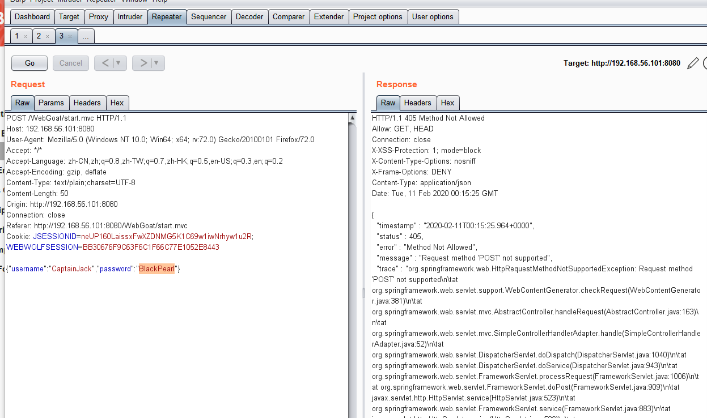
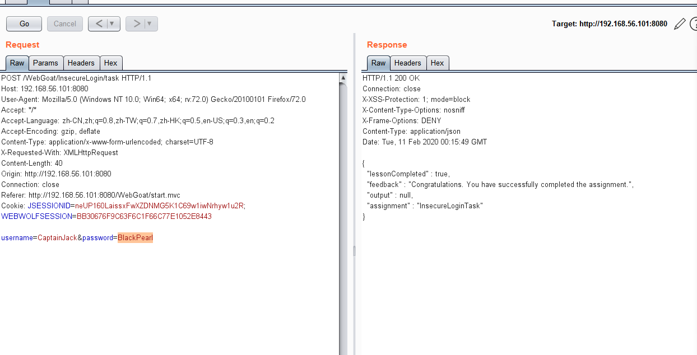

# Insecure Login

## lesson1

#### 概念 

加密是用于安全通信的非常重要的工具。 在本课程中，我们将找出为什么发送敏感数据时应始终使用它。 

#### 目标 

- 用户应该对数据包嗅探器用法有基本的了解 
-  用户将能够拦截和读取未加密的请求

## lesson2

单击“login”按钮发送包含其他用户登录凭证的请求。然后，将这些凭据写入适当的字段并提交以进行确认。尝试使用包嗅探器拦截请求

通过bp拦截能拦截到其他用户的登录账户和密码

