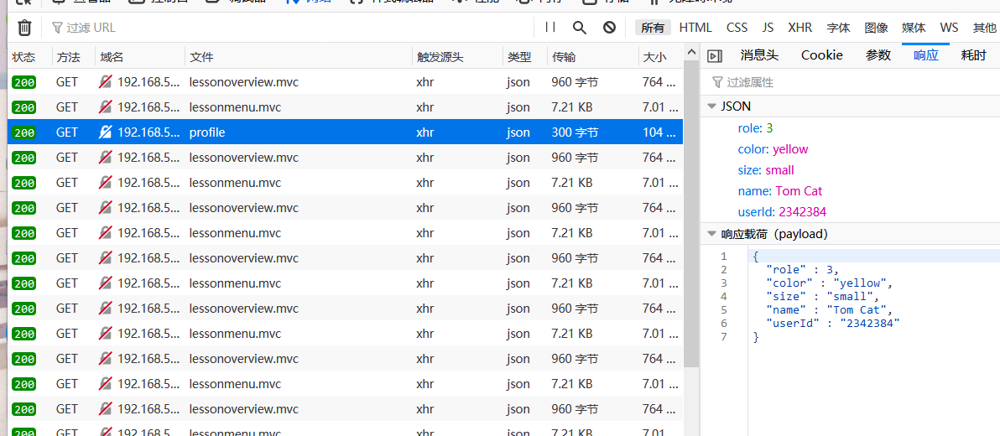
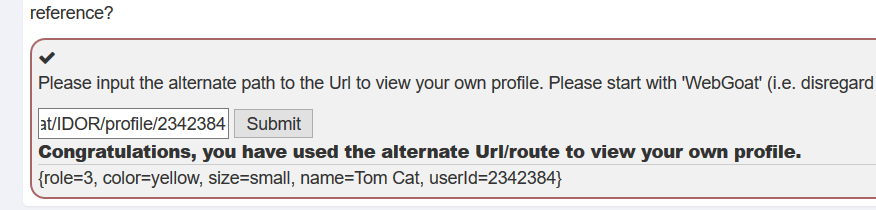
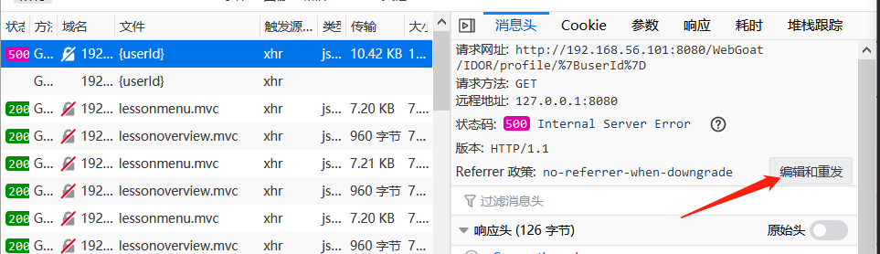
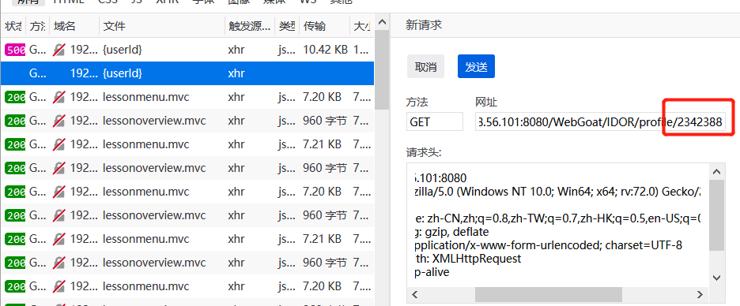
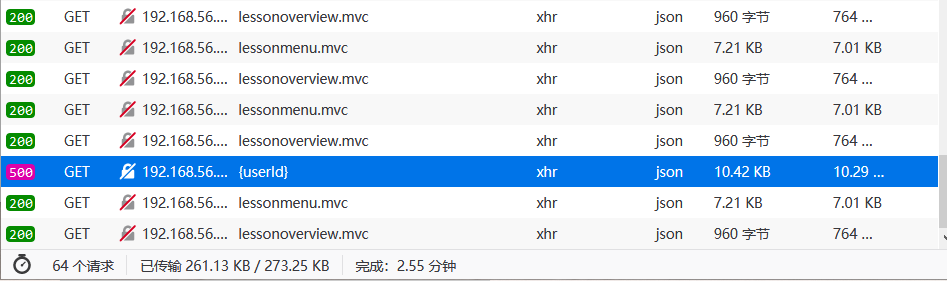
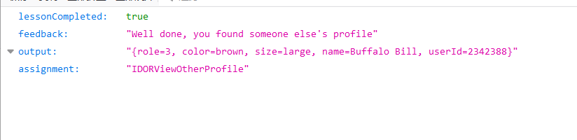

# Broken Access Control

## 不安全的直接对象引用

**直接对象引用**

直接对象引用是指应用程序使用客户端提供的输入来访问数据和对象

**例子**

使用GET方法的直接对象引用的示例可能类似如下

```
https://some.company.tld/dor?id=12345
https://some.company.tld/images?img=12345
https://some.company.tld/dor/12345
```

**其他方法**

POST、PUT、DELETE或其他方法也有潜在的易感性，主要区别在于方法和潜在负载。

**不安全的直接对象引用**

当引用没有被正确处理时，这些被认为是不安全的，并允许授权绕过或公开可能用于执行操作或访问用户不应该执行或访问的数据的私有数据。假设作为一个用户，你去查看你的个人资料，URL看起来像这样:

https://some.company.tld/app/user/23398

…你可以在那里查看你的资料。如果你导航到:

https://some.company.tld/app/user/23399…或在结尾使用另一个号码。如果您可以操作编号(用户id)并查看另一个人的配置文件，则对象引用是不安全的。当然，除了查看数据的GET方法之外，还可以检查或扩展此方法来操作数据


**首先进行身份验证，然后滥用授权**

许多访问控制问题容易受到来自经过身份验证但未经授权的用户的攻击。让我们从合法的验证开始。然后，我们将寻找绕过或滥用授权的方法。

本例中账户的id和密码是“tom”和“cat”(这是一个不安全的应用程序，对吗?)

验证之后，进入下一个屏幕


**观察差异和行为**

AppSec的攻击方面来看，一个一致的原则是查看从原始响应到可见响应的差异。换句话说(正如您在客户端过滤课中已经注意到的)，原始响应中的数据通常不会显示在屏幕/页面上。查看下面的配置文件并注意差异。


**猜测和预测模式**

以另一种方式查看你的个人资料

就概要文件而言，我们使用的应用程序似乎遵循RESTful模式。许多应用程序都有这样的角色:高级用户可以访问其他用户的内容。在这种情况下，just  /profile不起作用，因为自己用户的会话/身份验证数据不会告诉我们他们想查看谁的概要文件。那么，您认为使用直接对象引用显式查看自己的概要文件的模式是什么?

**Playing with the Patterns**

**查看另一个配置文件**

通过使用已用于查看自己的配置文件的替代路径查看其他人的配置文件。使用“查看配置文件”按钮，拦截/修改请求以查看另一个配置文件。或者，您也可以在浏览器中使用手动GET请求。

**编辑另一个配置文件**

较老的应用程序可能会遵循不同的模式，但RESTful应用程序(这里的情况就是这样)通常只是改变方法(是否包含body)来执行不同的功能。

利用这些知识获取相同的基本请求，更改其方法、路径和主体(有效负载)来修改另一个用户(Buffalo Bill)的配置文件。将角色更改为较低的角色(因为较高的特权角色和用户通常是较低的数字)。还可以将用户的颜色改为“红色”。


**安全对象引用**

在开始的时候就把目标放在心里

您的访问控制是否有文档记录?如果你不这样做，你怎么去执行它呢?访问控制由指导应用程序和/或隐私和其他法律的业务逻辑定义。

水平和垂直访问控制

我们经常从“角色”(用户、高级用户、管理员等)的角度考虑访问控制。但是，正如前面的练习中所指出的，具有相同“角色”的用户可以访问彼此的数据。这是水平访问控制。两者都应得到执行。

表1。访问控制矩阵实例端点方法描述角色，访问规则注释，注意事项

/配置文件

得到

查看用户配置文件

登录用户，只能查看自己的角色

管理员角色必须使用diff Url来查看其他人的配置文件(参见下面)

/ profile / {id}

得到

查看给定用户的用户配置文件

登录用户可以通过{id}查看自己的配置文件，管理员也可以查看

n /一个

/ profile / {id}

把编辑用户配置文件。配置文件对象提交从客户端与请求


登录用户可以编辑自己的档案由{id}，管理员也可以编辑。


必须记录管理编辑

审计访问

如上例所示，您的访问控制规则应该包括记录哪些访问的规定。例如，如果一个超级用户或管理员可以编辑其他人的资料，那就应该记录下来。其他示例包括检测到的违规或试图违反访问控制机制。

使用Indrect引用

没有很多应用程序使用它，但是您可以使用间接引用。在这种情况下，可以跨服务器上的散列、编码或其他函数运行引用，以便客户机看到的id不是服务器处理的实际引用。这将在一定程度上降低效率(一种常见的安全权衡)，而且仍有可能被猜测、强行或逆向工程。

这种方法不应该是唯一使用的保护。它可以作为一个附加层使用。您的服务器必须实现将客户机(间接)映射到服务器(直接)引用的逻辑。

访问控制和api

很多时候，api或RESTFul端点依赖于晦涩、静态“密钥”或用户缺乏想象力来控制访问。好的选项，例如数字签名的JSON  Web令牌(https://jwt.io)，是使用声明和数字/加密签名的组合来验证消费者的API身份验证和访问控制的好选项。其他新兴标准，如安全令牌绑定，承诺在请求头中为web服务提供“加密状态”……

# Missing Function Level Access Control

**缺少功能级访问控制**

访问控制，比如输出编码XSS，可能很难维护，并确保在整个应用程序包括每个方法/函数)中正确地执行它。

**IDOR vs缺少功能级访问控制**

事实上，许多人(包括本文作者)会将功能级访问控制和IDOR合并到“访问控制”中。为了OWASP，前十名和这些教训，我们将作出区分。最明显的区别是，IDOR更多的是一个“横向”或“横向”访问控制问题，而缺少功能级访问控制“暴露了功能”。尽管这里的IDOR课程演示了如何公开功能(至少是对相同角色的另一个用户)，但我们将查看公开功能的其他方式

# 解题

- lesson2

用给出的账号密码登录即可

- lesson3

 此题目是为了说明请求返回的包里可能包含了更多的内容。此题目要求将response包返回的所有参数比界面上`View Profile`中显示的多的几个参数，具体如下。 

`role`和`userId`两参数



- lesson4

  在lesson3中已经知道了tom的useId是2342384

  ```json
  {
    "role" : 3,
    "color" : "yellow",
    "size" : "small",
    "name" : "Tom Cat",
    "userId" : "2342384"
  }
  ```

  是通过路由访问tom的配置信息，在输入框中输入 `WebGoat/IDOR/profile/2342384`，就通过了此题目。 

  

- lesson5

  此题是根据自己的配置信息查看别人的配置信息，已经知道自己的id了可以通过加一的方式来猜测别人的id，可以发现 2342388 即为另一个人的id，则可以通过这个id查询他的配置信息。

  因为是get请求此题可以直接在网页上的开发者工具进行，bp上会拦截好多get请求就很烦。

  点击veiw profile可以看到我们发送的请求，点击该请求查看请求头，可以直接对请求头编辑重发。

  

  

  

  点击发送后可以看到响应，点开就可以看到id为2342388这位用户的配置信息。

  

  

