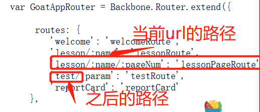

# XSS（Cross Site Scripting）

## lesson1

#### 概念

本课描述了什么是跨站点脚本(XSS)，以及如何使用它来执行不是开发人员最初意图的任务。

#### 目标

应该对XSS是什么以及它是如何工作的有一个基本的了

将了解反映的XSS是什么

将演示知识:

- 反射XSS注入
- 基于dom的XSS注入

## lesson2

#### XSS是什么?
跨站点脚本(通常也称为XSS)是一个缺陷/缺陷，它将html/脚本标记的许可作为输入，在没有编码或清理的情况下呈现到浏览器中

##### 跨站点脚本编制(XSS)是最常见和最有害的web应用程序安全性问题

虽然这种攻击有一个众所周知的简单防御方法，但在web上仍然有很多这样的例子。在修复方面，修复的覆盖范围也会成为一个问题。
##### XSS有显著的影响
特别是随着“富Internet应用程序”越来越普遍，通过JavaScript链接到的特权函数调用可能会受到影响。如果没有适当的保护，敏感数据(如您的身份验证cookie)可能会被窃取并用于他人的目的。
**快速的例子:**

- 从浏览器地址栏(chrome, Firefox)

```js
javascript:alert("XSS Test");
javascript:alert(document.cookie);
```

- 返回给客户机的任何数据字段都可能是可注入的 

  ```js
  <script>alert("XSS Test")</script>
  ```

  

## lesson3

#### 最常见的位置

- 将搜索字符串返回给用户的搜索字段

- 响应用户数据的输入字段

- 返回用户提供的文本的错误消息

- 包含用户提供的数据的隐藏字段

- 显示用户提供的数据的任何页面

  - 留言板

  - 自由形式的评论

- HTTP头信息


## lesson4

#### 我们为什么要关心这些呢?

**可能会导致XSS攻击：**

- 窃取会话cookie

- 创建错误的请求

- 在页面上创建假字段以收集凭据

- 将您的页面重定向到一个“不友好”的站点

- 创建伪装成有效用户的请求

- 窃取机密信息

- 在终端用户系统上执行恶意代码(活动脚本)

- 插入敌对和不适当的内容

```js

“>GoodYear recommends buying BridgeStone tires…
```


**XSS攻击增加了钓鱼攻击的有效性**

- URL中使用了一个有效的域

  

## lesson5

#### 跨站脚本攻击，跨站脚本分为三类

1. Reflected XSS Injection 反射型xss（前端-->后端-->前端）
   通过一个链接产生的xss叫做反射型xss，所有恶意内容都在url中。 

2. Stored XSS Injection 存储型xss（前端-->后端-->数据库-->前端）
   所有的恶意内容都在网页中，是攻击者通过漏洞将恶意内容写在数据库中，然后当其他用户访问含有这些恶意数据的网页时，就遭受了攻击。攻击位置常常在留言板，阅读列表等。

3. Dom-Based XSS Injection Dom型xss（前端）
   客户端脚本使用来自用户请求的恶意内容将HTML写入自己的页面。
   基于DOM的XSS是基于反射XSS的另一种形式。 这两者都是通过发送一个带有反映到浏览器的输入的链接来触发的。 DOM和’传统’反射XSS之间的区别在于，使用DOM时，有效载荷永远不会到达服务器。 它只会被客户端处理。

   XSS的产生原因是没有控制好用户的输入，让用户的输入可以添加到html页面中，如果用户的输入为js代码，就造成了html页面的js代码执行，js代码执行就会造成信息泄露等等

## lesson6

#### 反射XSS场景

- 攻击者向受害者发送恶意URL
- 受害者点击加载恶意网页的链接
- 嵌入在URL中的恶意脚本在受害者的浏览器中执行
- 脚本窃取敏感信息，如会话id，并将其释放给攻击者
  	- 受害者没有意识到攻击发生了

 受害者没有意识到攻击发生了 


## lesson8

#### 反射型和基于DOM的XSS

基于DOM的XSS是反射XSS的另一种形式。 两者都是通过发送带有输入的链接触发的，这些输入会反映到浏览器。  DOM和“传统”反射的XSS之间的区别在于，使用DOM，有效负载将永远不会到达服务器。 它只会由客户端处理。 

- 攻击者向受害者发送恶意URL 

- 受害者点击链接 

- 该链接可能会加载带有漏洞/路由/处理程序的恶意网页或他们使用的网页（已登录？）。 

- 如果是恶意网页，它可能会使用自己的JavaScript来通过易受攻击的路由/处理程序攻击另一个页面/网址 

- 易受攻击的页面在该页面/站点上的用户上下文中呈现有效负载并执行攻击 

- 攻击者的恶意脚本可能使用本地帐户的特权运行命令 

受害者没有意识到发生了攻击...恶意攻击者不使用`<script> alert（'xss'）</ script>`


**确定基于DOM的XSS的潜力** 

通常可以通过在客户端代码中查找路由配置来找到基于DOM的XSS。 寻找一条路由，将输入“反射”到页面上。 

对于此示例，您将需要在路由处理程序中查找一些“测试”代码（WebGoat使用骨干网作为其主要JavaScript库）。 有时，测试代码会留在生产环境中（通常，测试代码非常简单，并且缺乏安全性或任何质量控制！）。 

您的目标是找到路线并加以利用。 首先...虽然基本路线是什么？ 例如，查看本课程的URL  ......它看起来类似于/WebGoat/start.mvc#lesson/CrossSiteScripting.lesson/9。  在这种情况下，“基本路由”是：start.mvc＃lesson /之后的CrossSiteScripting.lesson /  9是由JavaScript路由处理程序处理的参数。 

那么，生产期间留在应用程序中的测试代码的路线是什么？ 要回答这个问题，您必须检查JavaScript源。

# 解题

## lesson2

这个题是为验证在浏览器中两个tab ，的cookie是否一样。

根据结果可以看出是一样的

## lesson7

试一试!反射的XSS确定哪些字段容易受到XSS的影响，验证服务器端上的所有输入始终是一个好的实践。当HTTP响应中使用未经验证的用户输入时，可能会发生XSS。在反射的XSS攻击中，攻击者可以使用攻击脚本创建一个URL，然后将其发布到另一个网站，通过电子邮件发送，或者通过其他方式让受害者点击它。查明字段是否容易受到XSS攻击的一种简单方法是使用alert()或console.log()方法。使用其中之一，找出哪些领域是脆弱的。 

要使用alert()检查字段是否容易受到xss攻击，通过尝试可以发现，输入卡号那里是容易收到攻击的。


## lesson10

####  识别基于dom的XSS的风险 

基于dom的XSS通常可以通过在客户端代码中查找路由配置来找到。寻找一条接收正在“反映”到页面的输入的路径。

对于本例，您需要在路由处理程序中寻找一些“测试”代码(**WebGoat使用 backbone 作为它的主要JavaScript库**)。有时，测试代码会留在生产环境中(通常情况下，测试代码非常简单，缺乏安全性或任何质量控制!)

你的目标是找到路线并利用它。首先，基地路线是什么?举个例子，看看这节课的URL，它应该类似于`/WebGoat/start.mvc#lesson/CrossSiteScripting.lesson/9`。本例中的“基本路线”是: `start.mvc#lesson/`  ，`CrossSiteScripting`之后是由JavaScript路由处理程序处理的参数。

 那么，在生产期间留在应用程序中的**test**代码的路径是什么?要回答这个问题，您必须检查JavaScript源代码. 


此题是要寻找一条可以进行dom型的XSS攻击，要找到 JavaScript路由处理程序处理的参数。通过提示看需要看js代码

 根据提示能看出WebGoat使用backbone ， [Backbone Router路由](https://www.iteye.com/blog/yujianshenbing-1749831) 参考。

```do
Backbone.Router担任了一部分Controller（控制器）的工作，它一般运行在单页应用中，能将特定的URL或锚点规则绑定到一个指定的方法（后文中称Action）。 
```


打开代码可以看到，js代码使用的模块化编写的（方便调用）， Backbone.Router.extend() 就是定义的路由路线了，当前的url是`/WebGoat/start.mvc#lesson/CrossSiteScripting.lesson/9`

```
就是：

:name=CrossSiteScripting.lesson

:pageNum=9
当前url的路由是start.mvc#lesson
```

根据这个就能显而易见test代码所处的路由了

**start.mvc#lesson**





## lesson11

**试一试!基于dom的XSS**

有些攻击是“盲目的”。幸运的是，您的服务器在这里运行，因此您可以判断是否成功。使用您刚刚找到的路由，看看是否可以使用它从路由中反映的参数而不进行编码，从而在WebGoat中执行内部函数。要执行的函数是……

webgoat.customjs.phoneHome ()

当然，您可以使用console/debug来触发它，但是您需要通过新选项卡中的URL来触发它。

一旦您触发它，随后的响应将带着一个随机数到达您的浏览器控制台。把那个随机数写在下面。

上一道题已经找到了攻击的路径，本题是根据找到的攻击路径进行一个简单的攻击，需要查看js代码。


**hide hints：**

1. 打开一个新选项卡，并导航到您刚刚在前一课中找到的测试路线 ，

2. 您的url应该类似于http://localhost:8080/webgoat /start.mvc# replace-with-thetestroute /some_parameters 
3.  请注意您发送给测试路由的参数是如何被反射回页面的。现在将JavaScript添加到其中。 
4.  您必须使用脚本标记，以便在将JavaScript代码呈现到DOM中时执行 
5.  将URL参数中的'/'替换为'%2F'。 

```js
define(['jquery',
    'libs/jquery-vuln',
    'jqueryui',
    'underscore',
    'backbone',
    'goatApp/controller/LessonController',
    'goatApp/controller/MenuController',
    'goatApp/view/LessonContentView',
    'goatApp/view/MenuView',
    'goatApp/view/DeveloperControlsView',
    'goatApp/view/TitleView'
], function ($,
             $vuln,
             jqueryui,
             _,
             Backbone,
             LessonController,
             MenuController,
             LessonContentView,
             MenuView,
             DeveloperControlsView,
             TitleView) {

    function getContentElement() {
        return $('#main-content');
    };

    function render(view) {
        $('div.pages').hide();
        //TODO this works for now because we only have one page we should rewrite this a bit
        if (view != null) {
            $('#report-card-page').show();
        } else {
            $('#lesson-title').show();
            $('#lesson-page').show();
        }
    };

    var GoatAppRouter = Backbone.Router.extend({

         routes: {
            'welcome': 'welcomeRoute',
            'lesson/:name': 'lessonRoute',
            'lesson/:name/:pageNum': 'lessonPageRoute',
            'test/:param': 'testRoute',
            'reportCard': 'reportCard'
        },

        lessonController: null,
        menuController : null,
        titleView: null,

        setUpCustomJS: function () {
            webgoat.customjs.jquery = $; //passing jquery into custom js scope ... still klunky, but works for now
            webgoat.customjs.jqueryVuln = $vuln;

            // shim to support xss lesson
            webgoat.customjs.phoneHome = function (e) {
                console.log('phoneHome invoked');
                webgoat.customjs.jquery.ajax({
                    method: "POST",
                    url: "/WebGoat/CrossSiteScripting/phone-home-xss",
                    data: {param1: 42, param2: 24},
                    headers: {
                        "webgoat-requested-by": "dom-xss-vuln"
                    },
                    contentType: 'application/x-www-form-urlencoded; charset=UTF-8',
                    success: function (data) {
                        //devs leave stuff like this in all the time
                        console.log('phone home said '  + JSON.stringify(data));
                    }
                });
            }

        },

        initialize: function () {
            this.menuController = new MenuController({menuView: new MenuView()});
            this.titleView = new TitleView();
            this.lessonController = new LessonController({lessonContentView: new LessonContentView(), titleView: this.titleView}),
            this.lessonController.start();
            webgoat = {};
            webgoat.customjs = {};

            this.setUpCustomJS();
            Backbone.history.start();
            this.listenTo(this.lessonController, 'menu:reload', this.reloadMenu)
        },

        lessonRoute: function(name) {
            render();
            this.lessonController.loadLesson(name, 0);
            this.menuController.updateMenu(name);
        },

        lessonPageRoute: function (name, pageNum) {
            render();
            pageNum = (_.isNumber(parseInt(pageNum))) ? parseInt(pageNum) : 0;
            this.lessonController.loadLesson(name, pageNum);
            this.menuController.updateMenu(name);
        },

        testRoute: function (param) {
            this.lessonController.testHandler(param);
            //this.menuController.updateMenu(name);
        },

        welcomeRoute: function () {
            render();
            this.lessonController.loadWelcome();
        },

        reloadMenu: function (curLesson) {
            this.menuController.updateMenu();
        },

        reportCard : function () {
            var self = this;
            require(['goatApp/view/ReportCardView'], function (ReportCardView) {
                self.titleView.render('Report card');
                render(new ReportCardView());
            });
        },
    });

    return GoatAppRouter;

});
```

可以看到这个 **webgoat.customjs.phoneHome()** 函数执行这个函数可以拿到JSON.stringify(data）的数据


