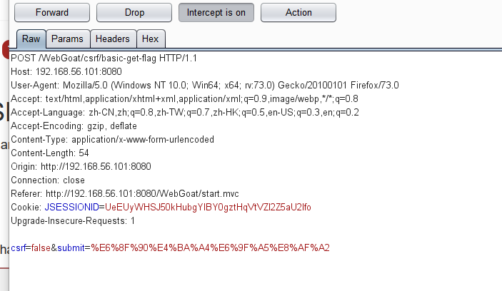
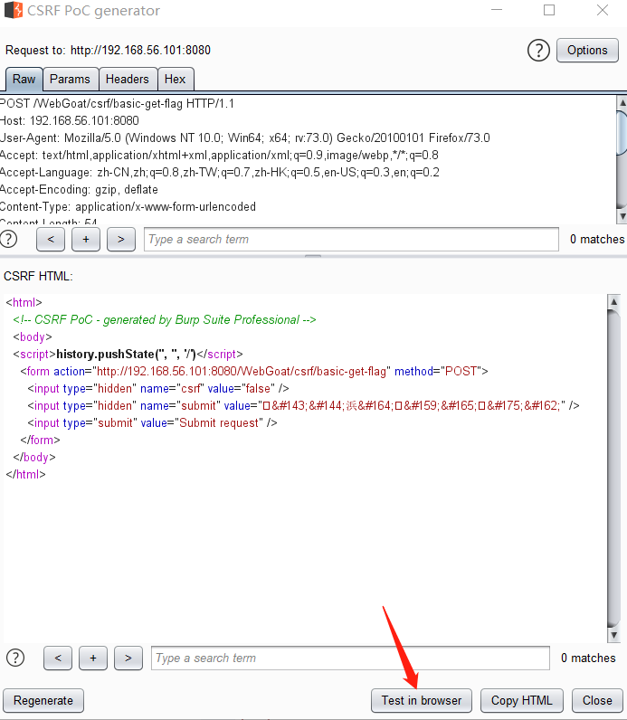
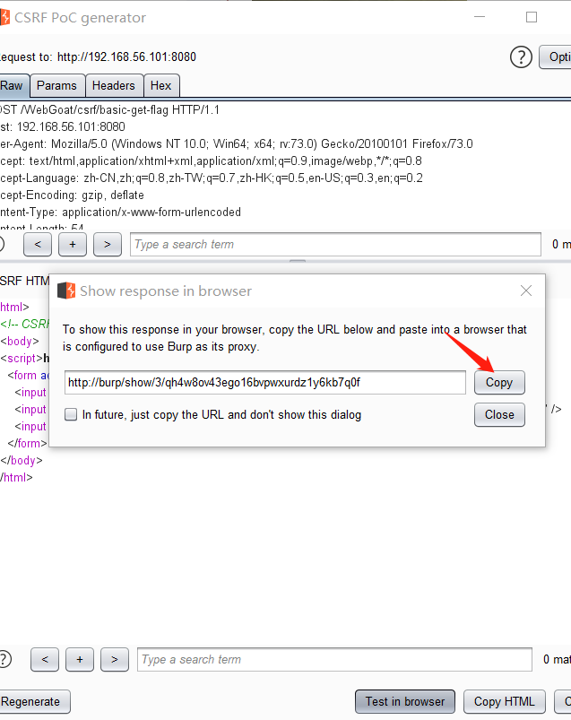
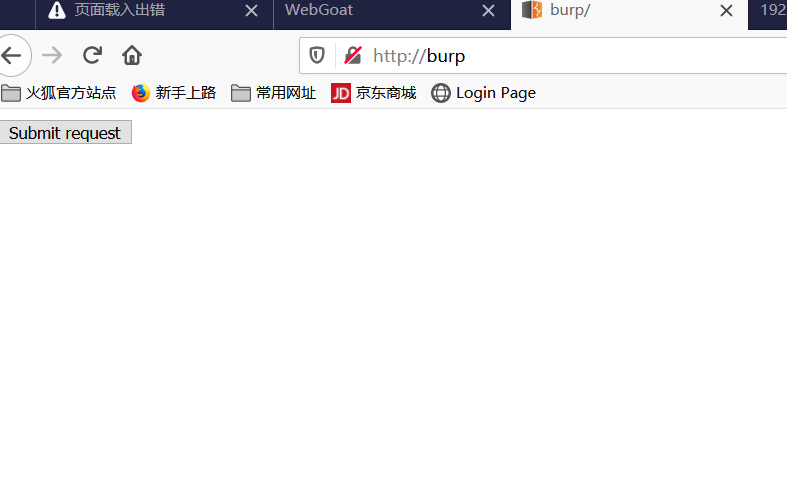
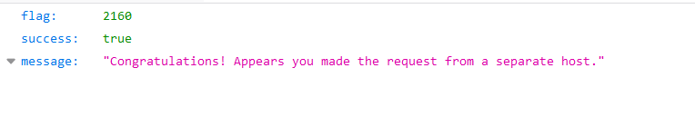
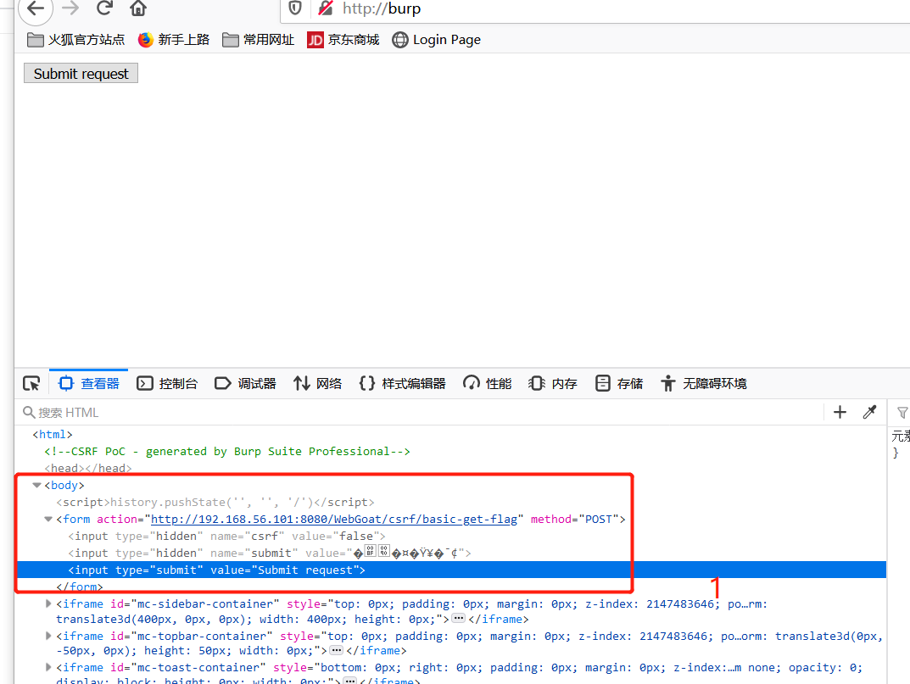

# Cross-Site Request Forgeries

## lesson1

#### 什么是跨站请求伪造?

**攻击者以你的身份，以你的名义发送恶意的请求**

跨站请求伪造，也称为一键攻击或会话骑乘，简称CSRF(有时发音为sea-surf)或XSRF，是一种恶意利用网站，未经授权的命令从**网站信任的用户传输**。跨站点脚本攻击(XSS)利用用户对特定站点的信任，而CSRF则利用站点对用户浏览器的信任。
跨站点请求伪造是针对web浏览器的“混乱代理”攻击。CSRF一般具有以下特点:

- 它涉及到依赖用户身份的网站。
- 它利用了网站对这种身份的信任。
- 它欺骗用户的浏览器将HTTP请求发送到目标站点。
- 它涉及到有副作用的HTTP请求。

处于风险中的web应用程序基于可信和经过身份验证的用户的输入执行操作，而不需要用户授权特定的操作。通过用户web浏览器中保存的cookie进行身份验证的用户可能会在不知情的情况下向信任用户的站点发送HTTP请求，从而导致不必要的操作。
CSRF攻击的目标是/滥用基本的web功能。如果该站点允许导致服务器状态改变，例如更改受害者的电子邮件地址或密码，或购买某些东西。强制受害者检索数据对攻击者没有好处，因为攻击者没有收到响应，受害者收到响应。因此，CSRF攻击的目标是状态更改请求。
让我们继续一些练习，以解决执行CSRF请求的方法。


#### csrf与xss的区别

- **XSS** 利用的是用户对指定网站的信任
- **CSRF** 利用的是网站对用户网页浏览器的信任

## lesson2

#### 带有GET请求的CSRF

这是要执行的最简单的CSRF攻击。例如，你收到一封电子邮件，内容如下:
`< a href = " http://bank.com/transfer?account_number_from = 123456789 &account_number_to = 123456789amount= 100000 " > View my Pictures!</a>` 


如果用户仍然登录bank.com网站，这个简单的GET请求将把钱从一个帐户转到另一个帐户。当然，在大多数情况下，网站可能有多个控件来批准请求

## lesson5

#### 来自框架的自动支持

大多数框架现在都默认支持防止CSRF。例如，在Angular中，拦截器从默认的XSRF-TOKEN中读取一个令牌，并将其设置为HTTP头文件X-XSRF-TOKEN。由于只有在您的域上运行的代码才能读取cookie，因此后端可以确定HTTP请求来自您的客户端应用程序，而不是攻击者。
为了使其工作，后端服务器在cookie中设置令牌。由于cookie的值应该由Angular (JavaScript)读取，所以这个cookie不应该被标记为只支持http的标志。在对服务器的每个请求中，Angular都会将令牌放在x - xsrf -令牌中作为HTTP头。服务器可以验证这两个令牌是否匹配，这将确保服务器在相同的域上运行请求。
**重点:定义一个单独的COOKIE，不要重用会话COOKIE**
请记住，应该始终使用只支持http的标志来定义会话cookie。

#### 自定义报头不安全

另一种方法是为每个调用添加一个自定义请求头。如果与服务器的所有交互都是用JavaScript执行的，那么这将有效。在服务器端，如果该头不存在，则只需要检查该头是否存在即可拒绝请求。有些框架默认提供了这种实现，但是研究员Alex Infuhr发现这也可以被绕过。

## lesson6

但是我只启用了JSON api，没有启用CORS，它们怎么会受CSRF影响呢?

许多web应用程序没有实现对CSRF的保护，它们只是使用application/json作为内容类型，这在某种程度上保护了它们。从浏览器使用此内容类型发出请求的惟一方法是使用XHR请求。在浏览器可以发出这样的请求之前，将向服务器发出飞行前请求(请记住，CSRF请求将是跨源请求)。如果飞行前响应不允许交叉源请求，浏览器将不会进行调用。

长话短说:这不是针对CSRF的有效保护。

为什么这种保护是不够的一个例子可以在这里找到。结果是允许Navigator.sendBeacon()发送任意内容类型的POST请求。

```
可以使用navigator.sendBeacon()方法异步地通过HTTP将少量数据传输到web服务器。此方法解决了分析和诊断代码的需求，这些代码通常尝试在卸载文档之前将数据发送到web服务器。越早发送数据，可能会错过收集数据的机会…
— developer.mozilla.org 

```

例如：

```
function postBeacon() {
    var data= new Blob([JSON.stringify({"author" :"WebGoat"})], {type : 'application/json'});
    navigator.sendBeacon("http://localhost:8083", data)
}
```

```
我认为内容类型的限制对于那些偶然对CSRF安全的网站是有用的。它们本来不是这样的，但是它们恰好只接受XML或JSON有效负载。

也就是说，很明显，依赖于这种行为的网站应该被修复，任何有信誉的测试人员都会指出这一点。问题在于，是浏览器有责任充当弱网站的保姆，还是应该让弱网站为伟大的正义做出牺牲。适者生存。

依我之见，答案是介于两者之间，一个好的第一步是记录所有这些同源策略陷阱，这些陷阱可能是网站安全所依赖的。

但是具体到这个bug，如果它没有得到修复，我不认为这是世界末日。但话说回来，在这个时代，也许有一种方法可以发射带有XML RPC接口的核导弹，所以这可能是世界末日。

— Eduardo Vel
```

 Firefox和Chrome都解决了这个问题，但它说明了为什么应该实现CSRF保护，而不是依赖于api的内容类型 

# 解题

## lesson3

####  基本的CSRF练习

击提交按钮，用bp拦截请求，可以看到是个post请求



是要模拟csrf攻击所以要自己发送一个请求，可以使用bp自动构造csrf Poc的工具来构造html文件发送请求












## lesson4

#### 代表别人发表评论

下面的页面模拟了评论/评论页面。这里的不同之处在于，您必须像使用CSRF攻击一样在其他地方发起提交，就像前面的练习一样。这比你想象的要容易。在大多数情况下，更棘手的部分是找到希望执行CSRF攻击的地方。典型的例子是某人银行账户的账户/电汇。
但是我们在这里依旧简单。在这种情况下，您只需要代表当前登录的用户触发一个审查提交。

跟上一个题做法类似。

## lesson7

#### CSRF和内容类型

在前一节中，我们了解了依赖content-type并不能防范CSRF。在本节中，我们将探讨另一种方法，可以对不受保护的api执行CSRF攻击。
在这个任务中，你需要实现以下JSON消息发送到我们的端点

```
POST /csrf/feedback/message HTTP/1.1

{
  "name"    : "WebGoat",
  "email"   : "webgoat@webgoat.org",
  "content" : "WebGoat is the best!!"
}
```

 记住，你需要从另一个地方call  	WebWolf可以帮忙，你需要登录到WebGoat 

