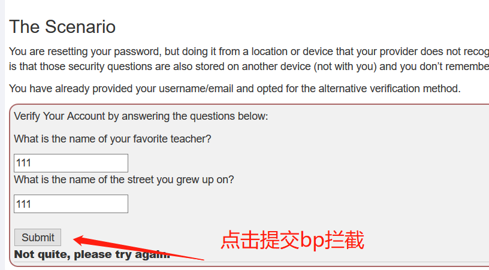
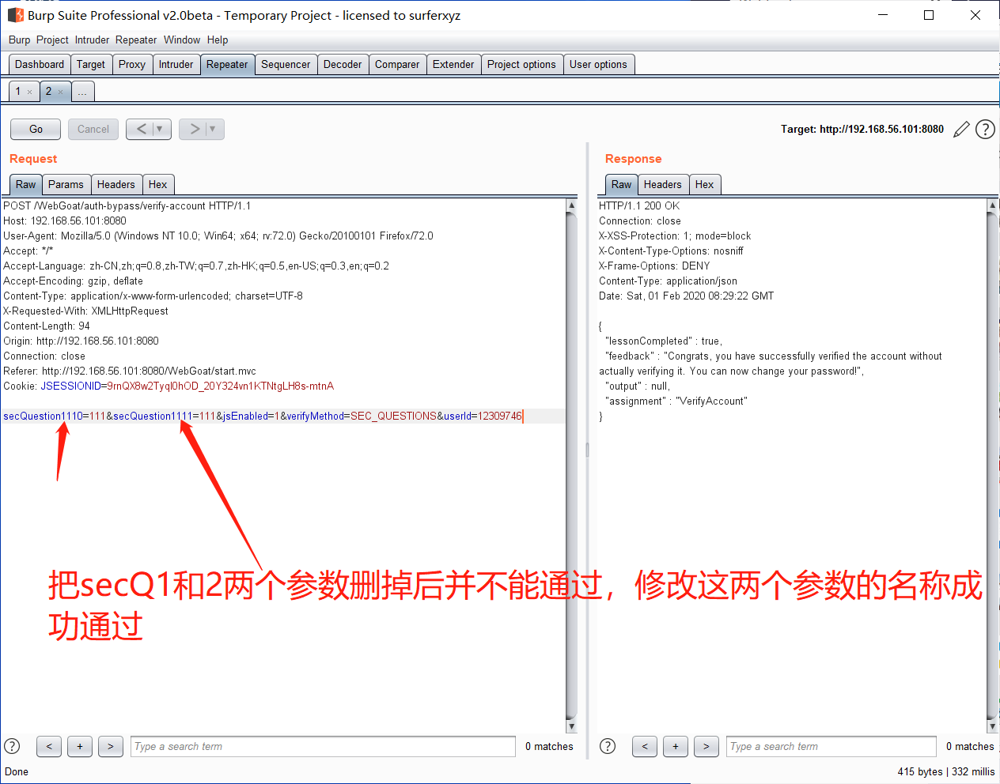

# 基础概念


## 什么是token

token是计算机术语：令牌，令牌是一种能够控制站点占有媒体的特殊帧，以区别数据帧及其他控制帧。token其实说的更通俗点可以叫暗号，在一些数据传输之前，要先进行暗号的核对，不同的暗号被授权不同的数据操作。基于 Token 的身份验证方法

使用基于 Token 的身份验证方法，在服务端不需要存储用户的登录记录。大概的流程是这样的：

1.客户端使用用户名跟密码请求登录

2.服务端收到请求，去验证用户名与密码

3.验证成功后，服务端会签发一个 Token，再把这个 Token 发送给客户端

4.客户端收到 Token 以后可以把它存储起来，比如放在 Cookie 里或者 Local Storage 里

5.客户端每次向服务端请求资源的时候需要带着服务端签发的 Token

6.服务端收到请求，然后去验证客户端请求里面带着的 Token，如果验证成功，就向客户端返回请求的数据

##  JSON Web Token（JWT）

 JSON Web Token（JWT）是目前最流行的跨域身份验证解决方案。

 该令牌采用base64编码，由三个部分组成header.claim .signature。此令牌的解码版本为: 

```
{
  "alg":"HS256",
  "typ":"JWT"
}
.
{
  "exp": 1416471934,
  "user_name": "user",
  "scope": [
    "read",
    "write"
  ],
  "authorities": [
    "ROLE_ADMIN",
    "ROLE_USER"
  ],
  "jti": "9bc92a44-0b1a-4c5e-be70-da52075b9a84",
  "client_id": "my-client-with-secret"
}
.
qxNjYSPIKSURZEMqLQQPw1Zdk6Le2FdGHRYZG7SQnNk
```

### 和Session方式存储id的差异

Session方式存储用户id的最大弊病在于要占用大量服务器内存，对于较大型应用而言可能还要保存许多的状态。一般而言，大型应用还需要借助一些KV数据库和一系列缓存机制来实现Session的存储。

而JWT方式将用户状态分散到了客户端中，可以明显减轻服务端的内存压力。除了用户id之外，还可以存储其他的和用户相关的信息，例如该用户是否是管理员、用户所在的分桶（见[《你所应该知道的A/B测试基础》一文](/2015/08/27/introduction-to-ab-testing/）等。

虽说JWT方式让服务器有一些计算压力（例如加密、编码和解码），但是这些压力相比磁盘I/O而言或许是半斤八两。具体是否采用，需要在不同场景下用数据说话。

它是服务器群集或面向服务的跨域体系结构的话，则需要一个统一的session数据库库来保存会话数据实现共享，这样负载均衡下的每个服务器才可以正确的验证用户身份。

## base64算法和url算法


# (A2）Broken Authentication

## Authentication Bypasses

### 认证绕过

身份验证绕过以多种方式发生，但通常利用配置或逻辑中的一些缺陷。篡改以达到合适的条件。

**隐藏输入**

最简单的形式是依赖于web页面/DOM中的隐藏输入。

**删除参数**

有时，如果攻击者不知道某个参数的正确值，他们可能会从提交中完全删除该参数，看看会发生什么。

**强迫浏览**

如果站点的某个区域没有被配置正确地保护，那么可以通过猜测/强制执行蛮力来访问该区域。

### The Scenario

您正在重新设置密码，但是从您的提供商不认识的位置或设备进行的。所以你需要回答你设置的安全问题。另一个问题是，这些安全问题也存储在另一个设备上(不在你身边)，你不记得它们。

您已经提供了您的用户名/电子邮件，并选择了另一种验证方法。







## JWT tokens


[10分钟了解JSON Web令牌（JWT)]( https://baijiahao.baidu.com/s?id=1608021814182894637&wfr=spider&for=pc )

 [八幅漫画理解使用JSON Web Token设计单点登录系统 ——— by John Wu](http://blog.leapoahead.com/2015/09/07/user-authentication-with-jwt/) 

 [跨站脚本攻击（XSS攻击）](http://www.cnblogs.com/bangerlee/archive/2013/04/06/3002142.html)