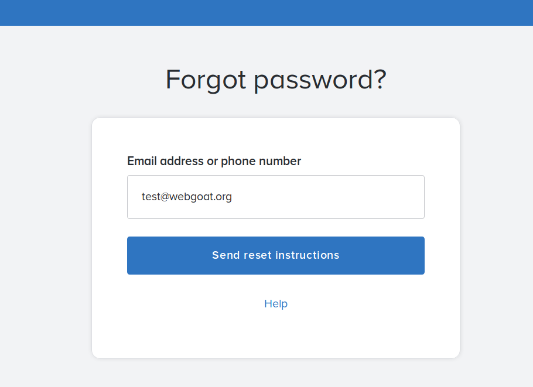
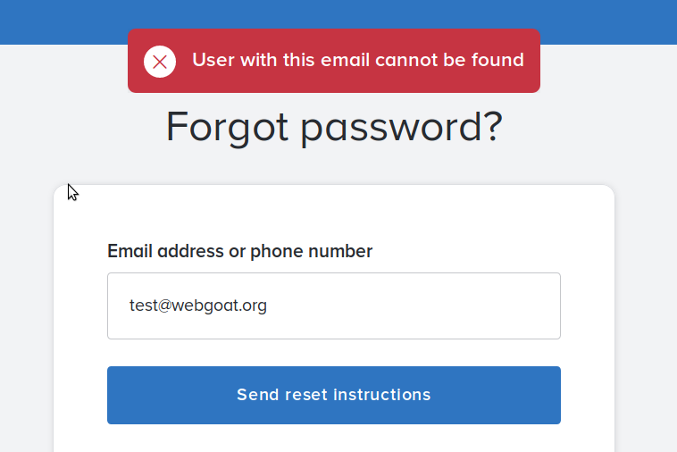
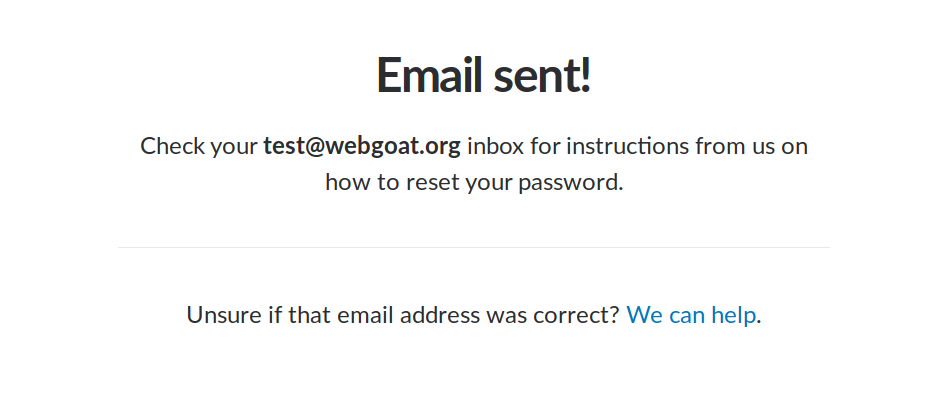
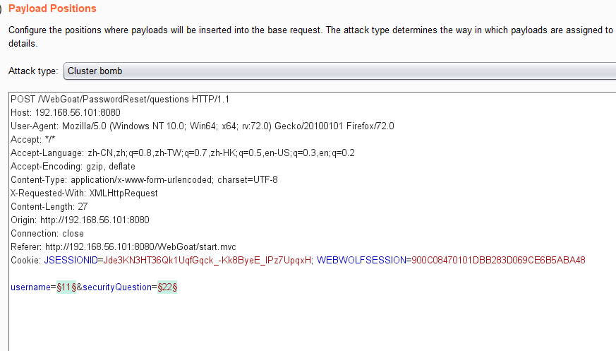
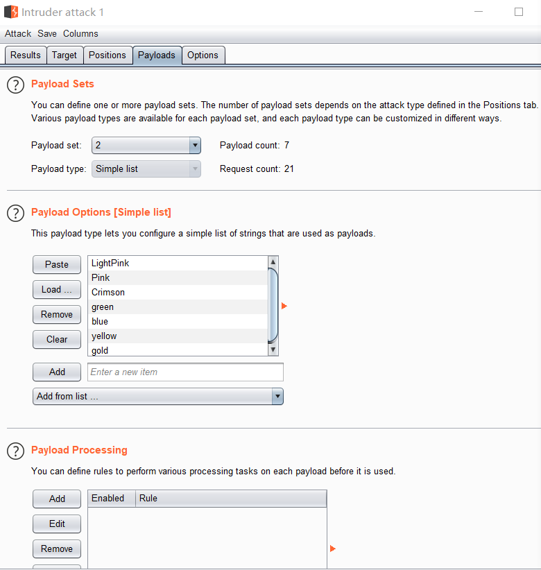
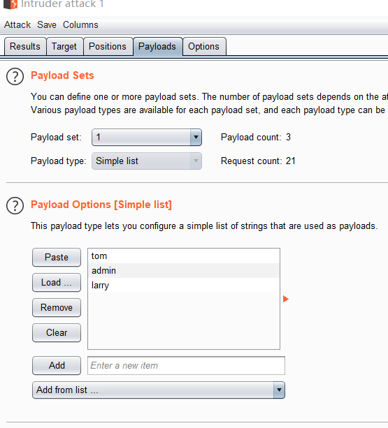
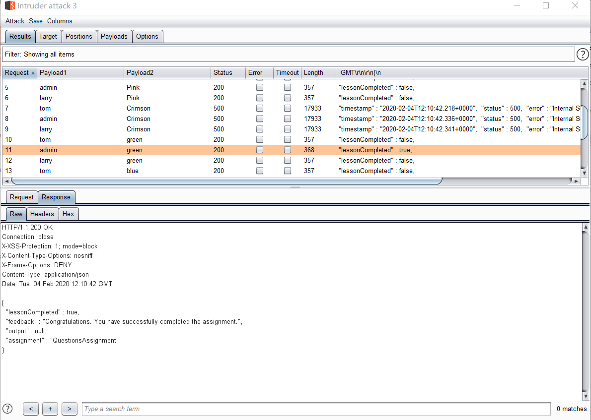

# Password reset

**概念**

这节课讲的是密码重置功能，它在大多数情况下是应用程序中被忽视的一部分，导致各种有趣的逻辑缺陷。 

**目标**

 教如何安全地实现密码重置功能在您的应用程序。 

**简介**

我们每个人都曾经在网站上使用过密码重置功能。每个网站以不同的方式实现这个功能。在一些网站上，你必须回答一些问题，在其他网站上，一封带有激活链接的电子邮件将发送给你。在这节课中，我们将通过一些最常见的密码重置功能，并展示它可能出错的地方。

还有一些公司会通过电子邮件将明文密码发送给用户。举几个例子，你可以看看http://plaintextoffenders.com/，在这里你会发现网站仍然用电子邮件给你发送明文密码。这不仅会让你质疑网站的安全性，也意味着他们会以明文形式存储你的密码

**电子邮件功能与WebWolf**

我们先做一个简单的任务,以确保你能够阅读电子邮件与WebWolf开始WebWolf(见这里)在下面的重置页面发送电子邮件到username@webgoat.org(@后面不重要部分)开放WebWolf和阅读电子邮件与您的用户名和密码登录提供的来函

个就很简单了就是忘记密码，通过注册的邮箱来找回自己的密码

**找出是否存在帐户**

如前所述，在密码重置期间，通常会根据电子邮件地址的存在与否找到不同的消息。就其本身而言，这可能看起来不是什么大问题，但它可以为攻击者提供可用于钓鱼攻击的信息。如果攻击者知道您在站点上有一个注册帐户，那么攻击者可以创建一个钓鱼邮件并将其发送给用户。用户可能更想点击电子邮件，因为用户在网站上有一个有效的帐户。另一方面，对于一些网站来说，这并不重要，但是一些网站用户想要更多的隐私。

下面的截图来自一个真实的网站:

 下面你可以看到Slack是如何实现相同的两个页面的，无论你输入什么电子邮件地址的消息将是完全相同的 

**安全问题**

这是一个问题，仍然是很多网站，当你失去了你的密码，网站会问你一个安全问题，你在注册过程中回答。大多数情况下，这个列表包含固定数量的问题，有时甚至只有有限的答案。为了使用这个功能，用户应该能够自己选择一个问题并键入答案。这样，用户就不会共享问题，从而使攻击者更加困难。

需要记住的重要一点是，这些安全问题的答案应该与用于在数据库中存储密码的安全性级别相同。如果数据库泄漏，攻击者应该不能根据安全问题的答案执行密码重置。

如今，用户在社交媒体上分享了如此多的信息，用安全问题来重置密码变得越来越困难，一个很好的安全问题资源是: http://goodsecurityquestions.com/ 

虽然安全问题一开始似乎是进行身份验证的好方法，但它们也有一些大问题。

“完美”的安全问题应该很难破解，但很容易记住。答案也需要修改，所以一定不能改变。

只有少数几个问题符合这些标准，实际上没有一个问题适用于任何人。

**如果你不得不选择一个安全问题，我们建议你不要如实回答。**

**创建密码重置链接**

当创建一个密码重置链接，你需要确保:

- 它是一个随机令牌的唯一链接

- 它只能使用一次

- 该链接只在有限的时间内有效。

发送带有随机令牌的链接意味着攻击者无法通过开始阻止用户来对您的网站发起简单的DOS攻击。该链接不应使用超过一次，这使它不可能再更改密码。超时是限制攻击窗口所必需的，拥有链接为攻击者打开了许多可能性

# Secure Password

#### NIST的密码标准 

NIST密码标准(也被称为特殊出版物(SP) 800-系列)是一个为实现安全密码系统提供建议的指南。

**密码规则**

以下是最新的NIST标准提出的一些最重要的建议:

- 没有组合的规则

不要要求用户如在密码上使用至少一个大写字母和一个特殊字符。给他们机会，但不要强迫他们!

- 没有密码提示

如果你想让人们有更好的机会猜测你的密码，把它写在你的屏幕上。

- 没有安全问题

安全问题，也称为基于知识的认证(KBA)已经过时了。问用户“你的宠物叫什么名字?”或者类似的东西来检查是不是真的是他，是很不安全的。

如果你想让用户遵从你的要求，选择长而难猜的密码，你不应该让他们在一段时间后不必要地更改密码。

- 最小8个字符

现在的安全密码应该至少有8个字符长(最多64个字符)。这是最小值，不是最大最小值!

- 支持所有UNICODE字符

您应该允许密码中的所有UNICODE字符。这也包括表情符号和空白。

- 强度计

在密码创建页面上添加一个强度计，帮助用户选择一个强而安全的密码。

- 根据已知的错误选择检查密码
  - 从以前的破解公司获得的密码
  - 字典里的单词
  - 重复字符或连续字符(如' aaaaaa '、' 1234abcd ')
  - 上下文相关的词，如服务的名称、用户名及其派生

**可用性**

除了上述建议外，NIST标准还建议提高密码表单的可用性，以增加用户选择安全可靠的密码的可能性。其中一些是:

- 允许粘贴到密码输入

用户在输入密码时应该能够使用“粘贴”功能。由于这方便了密码管理器的使用，也增加了用户选择强密码的可能性。

- 允许显示密码

密码输入应该有一个选项来显示输入的密码，以帮助用户成功地输入密码。

- 提供强度计

在密码创建页面上添加一个强度计，帮助用户选择一个强而安全的密码。

#### 你的密码安全吗?

你的密码安全吗?

有些网站允许测试你的账户是否在过去的数据泄露中被攻破。

去我已被Pwned或DEHASHED每个例子和测试如果你的帐户被攻破。如果是，最好现在就更改密码!

**你可以做什么来提高你的帐户的安全性?**

* 不同的帐户使用不同的密码

  最好不要为多个帐户使用相同的密码，而是为每个帐户使用不同的密码。

  - 使用密码

    使用像Diceware这样的密码生成器来生成密码。密码是由许多单词组成的密码，而不是随机生成的字符序列。这让我们人类更容易记住它们。顺便说一句:时间越长越好!

     - 使用密码管理器（lastpass等）

       如果你不能记住所有不同的密码，使用密码管理器创建一个然后安全地存储你的密码。

- 使用双因素身份验证

  如果可能的话，使用两个因素身份验证方法来为您的帐户添加额外的安全层。

#### 存储密码

在创建了强而安全的密码之后，还必须以安全的方式存储它。NIST给出了应用程序应该如何处理密码以及如何安全存储密码的建议。

**如何储存密码?**

- 首先:使用加密和受保护的通道来请求密码

  验证者在请求记忆的秘密时，应使用经过认证的加密和经过认证的受保护通道，以抵抗窃听和MitM (Man-in-the-middle)攻击。

- 抵抗离线攻击

  密码应该以抵抗离线攻击的形式存储。

- 使用盐

  密码在储存之前应该加盐。盐的长度至少为32位，可以任意选择，以最小化存储哈希值之间的盐值冲突。

- 使用哈希

  在存储密码之前，应该使用单向密钥派生函数进行散列。该函数将密码、salt和一个成本因子作为输入，然后生成一个密码散列。

  合适的关键派生函数示例:

  - 基于密码的密钥导出函数2 (PBKDF2)(尽可能大，应至少经过10000次迭代)
  - [ [BALLOON]]( https://pages.nist.gov/800-63-3/sp800-63b.html#SP800-132 )
  - 密钥派生函数应使用经批准的单向函数，如:
    - 键控哈希消息认证码(HMAC)
    - 任何在 [ SP 800-107](https://pages.nist.gov/800-63-3/sp800-63b.html#SP800-107) 中被批准的哈希函数
    - 安全哈希算法3 ( [SHA-3](https://pages.nist.gov/800-63-3/sp800-63b.html#FIPS202)) )
    -  [CMAC](https://pages.nist.gov/800-63-3/sp800-63b.html#SP800-38B) 
    - Keccak消息验证码(KMAC)
    - 可定制的震动(cSHAKE)
    -  [ParallelHash](https://pages.nist.gov/800-63-3/sp800-63b.html#SP800-185) 

- 内存硬键导出功能

  使用内存硬键派生函数进一步增加执行攻击所需的成本。

- 高成本的因素

  关键派生函数的成本因子(迭代计数)应该在验证服务器性能允许的范围内尽可能大。(至少10.000次迭代)

# 题目

* lesson4

  这个题是重置用户的登录密码，在忘记密码是会根据安全问题来找回密码，如果密码太简单就可以使用爆破的方法来找到这个安全问题的答案。

  要爆破两个变量，用户名和安全问题，设置两个payload，用户名题目中已经给了` "tom", "admin" and "larry"`，安全问题可以寻找一个常用的颜色字典就可以爆破出来是`green`

  

  

  

**任务**

如果能正确地回答这个秘密问题，用户可以找回他们的密码。这个“忘记密码”页面没有锁定机制。你的用户名是“webgoat”，你最喜欢的颜色是“red”。目标是检索另一个用户的密码。你可以尝试的用户是:“tom”，“admin”和“larry”

* lesson6

  

  

**任务**

尝试将Tom (tom@webgoa-cloud.org)的密码重置为您自己选择的密码，并使用该密码登录为Tom。注意:本课不可能使用OWASP ZAP，而且浏览器可能无法工作，curl等命令行工具将更适合这种攻击。

汤姆总是在收到带有链接的电子邮件后立即重置密码。