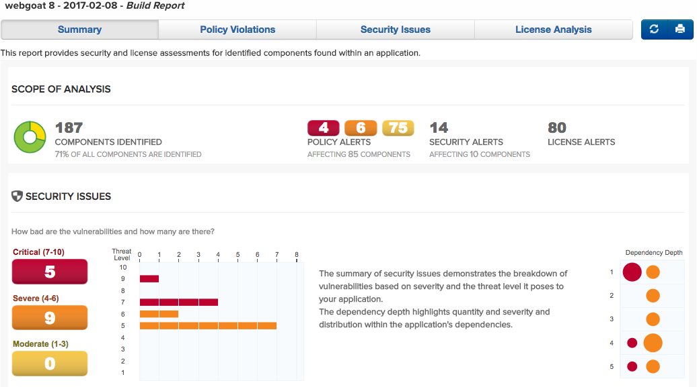
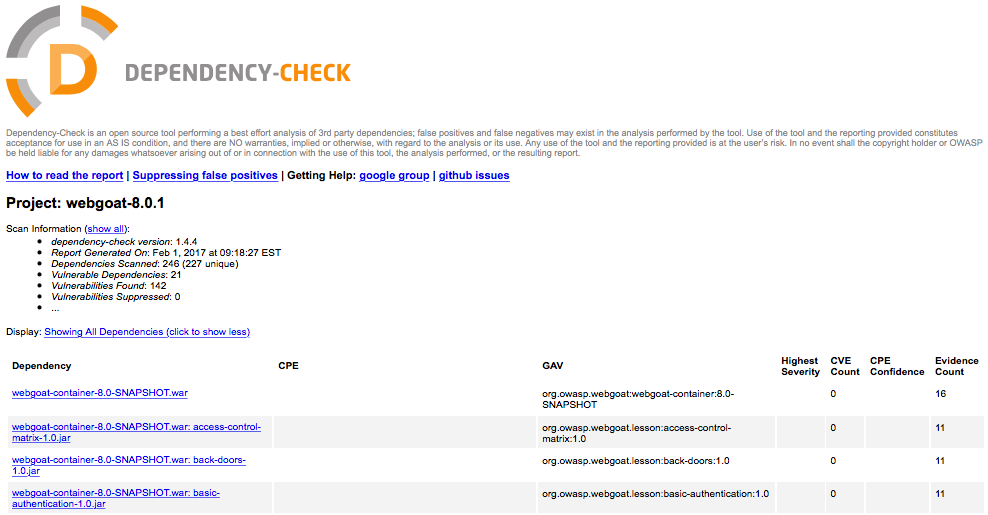
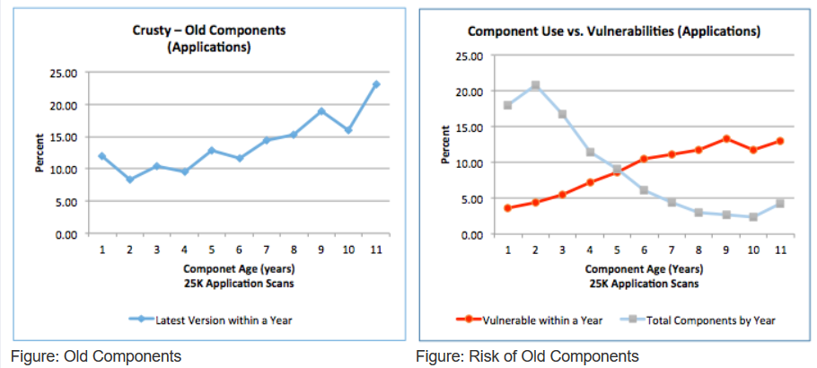

# （A9）Vulnerable Components

## lesson1

#### Concept

我们构建软件的方式已经改变了。开放源码社区正在成熟，开放源码软件的可用性已经变得非常丰富，而无需确定我们的应用程序中使用的库的来源。参考:软件供应链这一课将通过管理依赖库的困难，不管理这些依赖的风险，以及确定你是否处于风险中的困难。 

#### 目标

- 要认识到，所使用的开放源码与您自己的定制代码一样重要。

- 在我们的开源组件使用过程中，了解管理或缺乏管理。

- 理解材料清单在确定开源组件风险中的重要性

## lesson2

#### 开源生态系统

- 超过10百万个GitHub代码存储库 

- 100万个Sourceforge代码存储库 

- 2500个公共二进制存储库 

  - 一些存储库具有严格的发布者标准 

  - 一些存储库强制执行源代码分发 

  - 不能保证已发布的源代码是已发布二进制文件的源代码 

     - 一些存储库允许针对同一版本重新发布一组不同的位 

     - 一存储库允许您删除已发布的工件 

       

- 许多不同的包装系统； 即使是相同的语言

- 不同的坐标系统和粒度级别

## lesson4

#### 组件无处不在

WebGoat使用了近200个Java和JavaScript库。与大多数Java应用程序一样，我们使用maven来管理我们的Java依赖项，并且我们采用了非常疯狂的策略来管理JavaScript。

##### WebGoat中的脆弱组件?

当这个课程被创建的时候，WebGoat在它的组件中包含了超过12个高安全风险。其中大多数都不是经过深思熟虑的选择。开发人员应该如何在数百个组件中跟踪这些信息 

## lesson6

- 我们如何定义开源组件的风险？

- 我们如何发现开源组件的风险？ 
  - 我们如何将特定风险与特定版本的开源组件相关联？ 
- 我们如何知道某个组件何时发布新版本？ 
- 我们如何知道在以前的“良好”组件上是否发现了新漏洞？ 
- 我们如何知道我们是否使用开源组件的真实版本？

## lesson7

### 如何生成物料清单

有几种开源和付费解决方案可以识别组件中的风险。 但是，没有多少工具可以提供应用程序中使用的“成分”的**完整列表**。 OWASP Dependency Check提供了生成物料清单和识别潜在安全风险的功能。 
依赖性检查使用一些证据来确定库名称。 以下是报告的摘要：

## lesson8

####  安全信息重载 
**重要的是什么？** 

- 我的组件可以利用吗？ 
       
-  我的组件是真实副本吗？ 
  - 我了解为什么修改了我的组件吗？ 

**安全信息零星散布** 

   - 多种安全建议来源 
     -  国家漏洞数据库中的80,000多个CVE 
     -  节点安全项目，Metasploit，VulnDB，Snyk等... 
     -  成千上万的网站安全咨询，博客，推文等... 
        - 每天产生600,000个GitHub事件 
     -  700个GitHub安全相关事件 
     -  发行说明，更改日志，代码注释，... 
        

**摘要** 

   - 期望开发人员不断研究每个组件是不合理的。 

   - 开发人员不是安全专家； 他们已经有一份临时工作。

     

## lesson9

#### 许可证信息超载 

- 重要的是什么？ 
  - 我可以在软件分发范围内使用此组件吗？   
  - 是否存在许可证不兼容？ 
  - 如果使用修改后的组件，我是否要解决其他许可义务？ 

- 许可证信息零星散布 

  - 项目申领许可证： 
    - 在项目元数据文件中。         
    -  在项目网站或源代码存储库页面上。        
    -  使用他们自己的源代码存储库中的许可证文件链接。       
    -   在项目源树中的许可证文件中。     
    -    在二进制META-INF文件夹中。 

  - 项目在源代码中包含许可证作为标头。 

- 摘要 
  - 很难确定许可证的范围。      
  - 一个项目通常存在许可证差异。 

  -   开发人员不是律师。

## lesson 10

#### 构建信息 

- 重要的是什么？ 
  - 我的组件是旧的还是稳定的 
  - 我的组件是旧的还是稳定的 
  - 我的组件不受欢迎吗 
  - 我缺乏升级是故意选择还是缺乏知识 

**总结** 

    - 保持组件最新非常困难

对于25,000个应用程序中分析的组件，发现： 

- 2岁的组件中有8％没有新版本 
- 11岁的组件中有23％没有更新的版本 
- 较旧的组件构成了大部分风险

# 解题

#### 漏洞利用并不总是在“您的”代码中 

以下是使用相同的WebGoat源代码，但使用不同版本的jquery-ui组件的示例。 一种是可利用的； 一个不是

**jquery-ui:1.10.4**

**jquery-ui:1.12.0 Not Vulnerable** 

这个题就是点击一下这两个按钮，一个是可以xss漏洞的利用，另一个则能够抵御xss漏洞的攻击